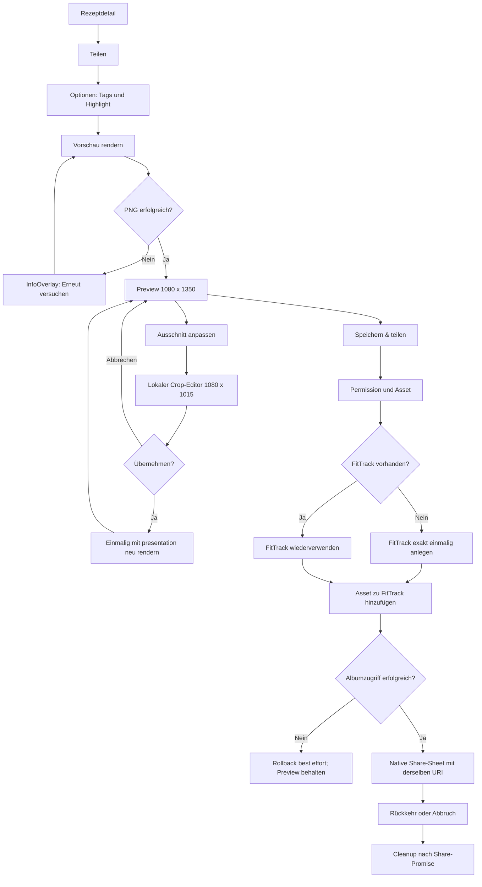
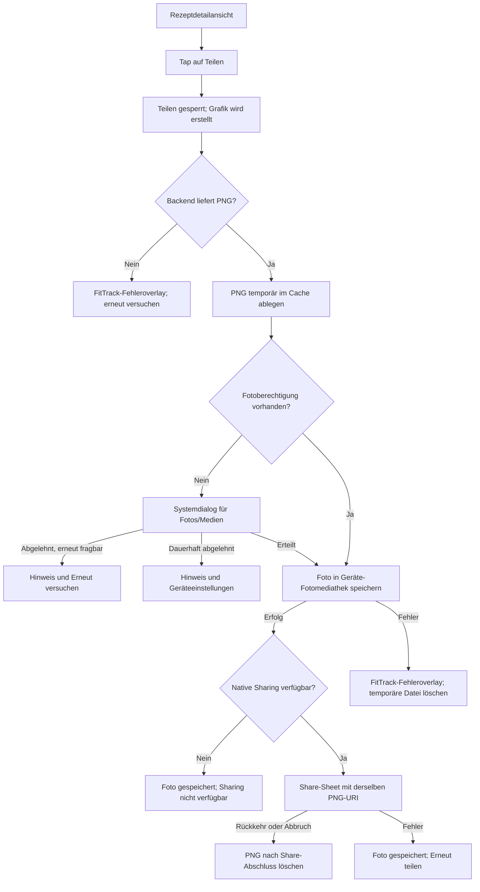

# Technischer Planner-Plan: US-09 Rezept teilen, Vorschau und Instagram-Bild speichern

- **User Story:** Rezeptdetail um `Teilen`, bearbeitbare Bildvorschau, lokales Speichern im Album `FitTrack` und natives Teilen erweitern
- **Status:** `APPROVED - IMPLEMENTATION AUTHORIZED`
- **Freigabe:** Nutzerentscheidung vom 18.09.2026: „Der User kann es selbst entscheiden, über eine Checkbox oder ähnliches. Lass das in den Plan einarbeiten, und sehe den plan danach als approved an und gehe in die umsetzung.“
- **Plan-Typ:** Cross-cutting Feature (Mobile, bestehender Backend-Renderer, API-Vertrag, native Medienablage, Release, QA)
- **Klassifikation:** Accept as proposed; die High-Protein-Darstellung ist als explizite Nutzerentscheidung für diese Presentation freigegeben
- **Infrastructure Impact:** `Dev`
- **Mobile Build Impact:** `Potential Native Impact`

Der Abschnitt bis zum Marker `Legacy draft` ist normativ und ausführbar. Die
Umsetzung ist ausdrücklich freigegeben; die empfohlene Ausführung beginnt mit
dem Backend und wartet nicht auf eine weitere `APPROVE`-Entscheidung. In
diesem Planner-Schritt wird ausschließlich dieses Planartefakt aktualisiert;
Produktionscode, Tests, Shared-, Knowledge-Base- und Infrastrukturdateien
werden nicht geändert.

## 0. Product-Owner-Freigabe und High-Protein-Semantik

Die letzte Product-Owner-Frage ist mit der Nutzerentscheidung vom 18.09.2026
aufgelöst. Der Nutzer entscheidet im Share-Options-Bottom-Sheet selbst, ob
die Share-Grafik das High-Protein-Symbol zeigt.

Normative Vorgaben:

- Das Options-Sheet enthält eine deutsche Checkbox oder einen gleichwertigen
  Toggle mit dem Label `High-Protein-Symbol anzeigen`.
- Der Default ist aus und wird als `Kein Highlight` dargestellt. Bei
  deaktiviertem Toggle sendet der Share-Flow `nutritionHighlight: null`.
- Bei aktiviertem Toggle darf der Share-Flow ausdrücklich
  `nutritionHighlight: 'high-protein'` senden. Der Wert wird als
  Presentation-Option für die sichtbare Grafik behandelt.
- Die Auswahl ist keine automatische High-Protein-Klassifikation. Es gibt
  keine Protein-Schwelle, keine neue Nutrition- oder Domainlogik, kein neues
  Rezeptfeld und keine Ableitung aus den serverseitigen Nutrition-Werten.
- Der Backend-Vertrag akzeptiert nur den expliziten, whitelisted
  `nutritionHighlight`-Wert des bestehenden Rendervertrags beziehungsweise
  `null`; beliebige oder erfundene Highlight-Werte werden abgewiesen. Der
  Client darf weiterhin keine Rezeptdaten als Quelle der Grafik einschleusen.
- Die sichtbare Auswahl bedeutet ausschließlich: Der Nutzer möchte dieses
  Symbol auf dieser Share-Grafik sehen. FitTrack behauptet dadurch nicht,
  dass die Nutrition-Daten automatisch klassifiziert oder fachlich als
  High-Protein-Rezept bestätigt wurden.

Damit gibt es im US-09-Umfang keine offene Product-Owner-Entscheidung und
keinen blockierten High-Protein-Zweig.

## 1. Anforderungsbewertung

### Nutzerproblem und Lösungsfit

Die geöffnete Rezeptdetailansicht soll einen natürlichen mobilen Weg bieten,
aus einem privaten Rezept eine fertig gestaltete Instagram-Grafik zu machen.
Vor dem endgültigen Speichern und Teilen soll der Nutzer sehen, was erzeugt
wird, den Fotoausschnitt begrenzt anpassen und auswählen können, welche der
gespeicherten Tags in der Grafik erscheinen. Erst nach ausdrücklicher
Bestätigung wird das Bild lokal im Gerätealbum `FitTrack` gespeichert und an
das native Betriebssystem-Share-Sheet übergeben.

Der vorhandene Backend-Renderer ist dafür die richtige Bildquelle. Er liefert
bereits ein direktes PNG mit exakt `1080 x 1350` Pixeln, besitzt einen
versionierten Hero-Crop-Vertrag und kann eine nicht persistierte
`presentation`-Überschreibung verarbeiten. Die neue Tag-Auswahl benötigt eine
kleine API-Erweiterung, weil der aktuelle strikte Request-Vertrag
clientseitige Rezept-Tags absichtlich nicht annimmt.

### Produkt- und Domänenbewertung

- Rezept, Bilder, Nutrition, Tags und Eigentümer bleiben serverseitig
  maßgeblich.
- Die Tag-Auswahl ist eine Auswahl aus bereits gespeicherten Rezept-Tags und
  keine Eingabe für neue Tags.
- Die lokale Ablage in `FitTrack` ist eine Betriebssystemaktion. Sie ist kein
  Google-Photos-Upload und keine FitTrack-Datenpersistenz.
- Das native Share-Sheet bestätigt höchstens die Rückkehr aus dem
  Betriebssystem-Share-Aufruf. Es bestätigt keinen Instagram-Upload und keine
  Zustellung an eine Ziel-App.
- `totalTimeMinutes = 30` und `difficulty = 'Einfach'` bleiben temporäre,
  zentral benannte Presentation-Platzhalter und werden nicht als Rezeptdaten
  gespeichert.
- Die High-Protein-Darstellung ist eine vom Nutzer gewählte Presentation-
  Option und keine fachliche Klassifikation. AI ist nicht erforderlich.

### Einfachheit und Architektur

Es wird kein neuer Navigationsstack und kein neuer Backend-Render-Endpunkt
benötigt. Der bestehende Endpunkt erhält ausschließlich die minimal nötige
serverseitig validierte `selectedTags`-Option. Mobile erhält einen lokalen
Share-Draft mit Optionen, Render-Vorschau, Crop-Editor und Medienstatus.

Die finale Grafik wird auch nach einer Crop-Änderung auf dem Backend gerendert.
Mobile rendert nicht selbst das vollständige Instagram-Layout und sendet keine
SAS-URL, keinen Blobnamen und keine frei erfundenen Rezeptdaten.

### KI-Bewertung

AI ist nicht erforderlich. Der Renderer, die Tag-Auswahl, der Crop-Merge und
der native Medienfluss sind deterministisch. Es gibt keine neue Prompt-,
Quota- oder Azure-OpenAI-Arbeit.

## 2. Produktverhalten

### Albumentscheidung

Die finale PNG-Datei wird in der lokalen Geräte-Fotobibliothek in einem Album
beziehungsweise Ordner mit dem exakten Namen `FitTrack` gespeichert.

- Beim ersten bestätigten Speichern fragt Mobile die erforderliche
  Schreib-/Add-Berechtigung an. Erst nach erfolgreicher Berechtigung wird das
  Asset aus der temporären PNG-Datei angelegt.
- Bei jedem Speichern sucht der Media-Service nach einem vorhandenen Album
  mit dem exakten Namen `FitTrack`. Existiert es, wird es wiederverwendet und
  das neue Asset hinzugefügt.
- Existiert es noch nicht, wird `FitTrack` im ersten erfolgreichen
  Speichervorgang mit dem neuen Asset angelegt. Die Album-ID wird nicht als
  dauerhafte FitTrack-Datenpersistenz in AsyncStorage gespeichert; bei
  späteren Vorgängen wird das Betriebssystemalbum erneut über seinen Namen
  gefunden. Dadurch werden veraltete IDs und doppelte Alben vermieden.
- Vorhandene andere Alben, Camera Roll/Recents und deren Medien werden nicht
  umbenannt, geleert, verschoben oder migriert. Ein vorhandenes Album mit dem
  exakten Namen `FitTrack` wird als Ziel verwendet, sofern der Plattformzugriff
  es zurückgibt.
- Ein Name wie `FitTrack (1)` oder `FitTrack Dev` ist kein Ersatz. Bei einem
  fehlenden exakten Treffer wird genau ein neues `FitTrack`-Album angelegt.
  Bei mehreren exakten Treffern darf der Adapter kein weiteres Album anlegen;
  er verwendet den dokumentierten Plattformtreffer deterministisch oder
  bricht bei nicht eindeutigem Zugriff fehlgeschlagen ab.
- Bei Fehlern beim Albumzugriff oder beim Hinzufügen des Assets wird kein
  Share-Sheet geöffnet und kein Erfolg gemeldet. Das neu angelegte Asset wird
  best effort wieder entfernt, ohne vorhandene Albuminhalte anzutasten. Die
  Vorschau bleibt für einen Retry erhalten. Kann ein Rollback nicht bestätigt
  werden, zeigt die UI keinen vollständigen Speichervorgang als erfolgreich an
  und dokumentiert den möglichen lokalen Rest als Fehlerzustand.

Das Verhalten gilt für iOS Fotos und Android MediaStore beziehungsweise die
jeweilige lokale Fotobibliothek. Ein aktiviertes Google-Photos-Backup kann das
lokale Foto anschließend synchronisieren, wird aber weder abgefragt noch von
FitTrack garantiert.

### Mehrstufiger End-to-End-Flow

1. In der Rezeptdetailansicht stehen `Bearbeiten`, `Teilen` und `Löschen` im
   Sticky Footer. `Teilen` verändert das Rezept nicht.
2. Ein Tap auf `Teilen` öffnet den lokalen Share-Flow und sperrt weitere
   Teilen-Taps. Es wird noch nichts gespeichert und kein Share-Sheet geöffnet.
3. Das Share-Options-Bottom-Sheet fragt in einem zusammenhängenden Schritt
  nach den Tags und zeigt die deutsche Checkbox beziehungsweise den Toggle
  `High-Protein-Symbol anzeigen`. Der Default ist aus und wird als `Kein
  Highlight` angezeigt. Tag-Auswahl und Toggle werden nur lokal im
  Share-Draft gehalten.
4. Nach `Vorschau anzeigen` sendet Mobile den ersten Render-Request. Der
  Server nutzt ohne `imageId` das primäre Rezeptbild, den gespeicherten oder
  effektiven Hero-Crop, serverseitige Rezeptdaten, die validierte
  Tag-Auswahl, den expliziten Highlight-Wert (`'high-protein'` oder `null`)
  und die temporären Meta-Platzhalter.
5. Die PNG-Antwort wird in eine eindeutige temporäre Cache-Datei geschrieben
  und in einer dunklen, app-eigenen Vorschau mit stabilem `1080:1350`-
  Seitenverhältnis angezeigt. Erst hier ist `Speichern & teilen` möglich.
6. `Ausschnitt anpassen` öffnet den bestehenden Hero-Crop-Editor mit dem
  primären Rezeptbild. Pan und Pinch-Zoom sind lokal; der gespeicherte
  Rezept-Crop wird nicht verändert.
7. Nach `Übernehmen` wird genau einmal mit der vollständig bestätigten
  `presentation` und derselben Tag-/Highlight-Auswahl abschließend neu
  gerendert. Das gilt auch, wenn der lokale Crop unverändert übernommen wird.
  Während Pan/Pinch werden keine Render-Requests gesendet.
8. Erst `Speichern & teilen` startet Berechtigung, Asset-Erstellung und Suche
  beziehungsweise Erstellung des Albums `FitTrack`.
9. Nach bestätigtem Hinzufügen zum Album öffnet Mobile das native Share-Sheet
  mit derselben temporären PNG-Datei-URI.
10. Nach Rückkehr, Abbruch oder Fehler des Share-Aufrufs wird die Datei nach
   der Promise-Auflösung bereinigt. Bei einem Share-Retry bleibt sie bis zum
   Retry oder bis zum Schließen erhalten.

### Zustandsmodell und Back-/Cancel-/Retry-Verhalten

| Zustand | Sichtbares Verhalten | Back/Cancel | Retry/Übergang |
|---|---|---|---|
| `idle` | Detailansicht und drei Footer-Aktionen | normale Navigation | `Teilen` öffnet `options` |
| `options` | Bottom-Sheet für Tags und `High-Protein-Symbol anzeigen`; Default aus/`Kein Highlight` | `Abbrechen`, Backdrop oder System-Back verwirft den Entwurf; kein Render | `Vorschau anzeigen` -> `renderingPreview` |
| `renderingPreview` | Spinner, gesperrte Aktionen, noch kein Speichern | aktiver Flow darf abgebrochen werden; fertige temporäre Dateien werden bereinigt | Erfolg -> `preview`, Fehler -> `renderError` |
| `preview` | PNG-Vorschau, Crop und `Speichern & teilen` | Schließen löscht die Vorschau-Datei und kehrt zurück | Crop starten; bei geänderter Auswahl zurück zu `options` |
| `editingCrop` | Bestehender Crop-Editor mit Hero-Safe-Area | Abbrechen verwirft nur den lokalen Crop | Übernehmen -> `rerenderingPreview` |
| `rerenderingPreview` | Letzte gültige Vorschau bleibt geschützt | Request-Abbruch lässt die letzte gültige Vorschau bestehen | Erfolg -> `preview`, Fehler -> `renderError` |
| `renderError` | `InfoOverlay` mit deutscher Erklärung | Schließen bleibt im Entwurfsschritt | `Erneut versuchen` wiederholt mit derselben Auswahl |
| `savingAsset` | Permission, Asset und Album werden verarbeitet | Systemdialog-Abbruch erhält die Vorschau; kein Share-Sheet | Erfolg -> `sharing` oder `shareUnavailable` |
| `permissionError` | Retry oder Link zu Geräteeinstellungen | Schließen kehrt zur Vorschau zurück | nach Berechtigung erneut speichern |
| `albumError` | Kein vollständiger Speichervorgang; Vorschau bleibt | Schließen verwirft nur temporäre Vorschau | Retry führt erneut über die Albumprüfung |
| `sharing` | Native Share-Sheet; temporäre URI bleibt erhalten | Rückkehr oder Abbruch ist kein Instagram-Erfolg | Promise-Ende -> `saved` oder `shareError` |
| `shareError` | Foto bleibt in `FitTrack`; `Erneut teilen` und `Schließen` | Schließen bereinigt temporäre Datei | Retry nutzt dieselbe URI und legt kein zweites Asset an |
| `shareUnavailable` | Foto gespeichert; Teilen auf dem Gerät nicht verfügbar | Schließen bereinigt temporäre Datei | kein Share-Sheet |
| `saved` | Deutsche Erfolgsmeldung: in `FitTrack` gespeichert | Schließen zur Detailansicht | Zustand zurücksetzen |

Ein Android-System-Back in einer Modalstufe schließt zuerst diese Stufe. Es
beendet nicht unbemerkt die Rezeptdetailansicht und öffnet kein Standard-
Alert. Informationen, Fehler und Entscheidungen verwenden `InfoOverlay`,
`ConfirmSheet` oder das bestehende Bottom-Sheet-Muster.

### Ablaufdiagramm



## 3. Tags, Highlight und Vorschau

### Tag-Auswahl

Das Options-Sheet zeigt `Welche Tags sollen auf dem Bild erscheinen?`, den
Zähler `<n> von 4 ausgewählt`, `Vorschau anzeigen` und `Abbrechen`. Die
Mehrfachauswahl hat keinen freien Texteingabepfad und verwendet nur die
gespeicherten Tags.

| Rezept-Tags | Vorauswahl | Verhalten |
|---:|---|---|
| 0 | keine | Hinweis `Für dieses Rezept sind keine Tags hinterlegt.`; `selectedTags: []` |
| 1 bis 3 | alle gespeicherten Tags | jeder Tag kann abgewählt werden |
| 4 | alle vier | jeder Tag kann abgewählt werden; es gibt keinen fünften |
| mehr als 4 | die ersten vier in gespeicherter Rezeptreihenfolge | weitere Optionen bleiben sichtbar, aber bei vier aktiven Tags deaktiviert |

Die Auswahl wird weder alphabetisch umsortiert noch clientseitig umbenannt.
Der Server entscheidet Reihenfolge und Labels aus `recipe.tags`. Unbekannte,
doppelte oder mehr als vier Werte werden nicht still entfernt, sondern als
kontrollierter `400`-Fehler abgewiesen. Ein gültiges leeres Array ist zulässig.
Vier erlaubte Tags können wegen tatsächlicher Breite zusätzlich
`TAG_ROW_OVERFLOW` auslösen; Tags werden nicht still abgeschnitten.

### High-Protein-Darstellung

Das Options-Sheet zeigt die deutsche Checkbox beziehungsweise den Toggle
`High-Protein-Symbol anzeigen`. Er ist standardmäßig deaktiviert und zeigt
dann `Kein Highlight`. Bei Aktivierung sendet Mobile für die initiale
Vorschau und den abschließenden Render ausdrücklich
`nutritionHighlight: 'high-protein'`; bei Deaktivierung sendet es
`nutritionHighlight: null`.

Der Wert steuert ausschließlich die Darstellung dieser Share-Grafik. Er ist
kein automatisch ermitteltes Nutrition-Ergebnis und darf weder aus einer
Protein-Schwelle noch aus einer anderen Nutrition- oder Domainregel abgeleitet
werden. Backend und Mobile führen keine solche Klassifikation ein. Der
Backend-Vertrag verwendet dafür eine geschlossene Whitelist und weist
beliebige oder unbekannte Highlight-Werte kontrolliert ab. Die UI bietet in
US-09 keine freie Highlight-Eingabe und keine weiteren Highlight-Werte an.

### Vorschau und Crop

Die Vorschau ist ein app-eigenes modales Preview-Surface innerhalb der
Rezeptdetailansicht und zeigt die tatsächlich serverseitig gerenderte PNG mit
stabilem Verhältnis `1080:1350`. Die initiale Vorschau zeigt Titel, gewählte
Tags, Nutrition, Meta-Zeile und den neutralen Highlight-Zustand; nach
`Übernehmen` ersetzt der einmalige abschließende Render diese Datei durch die
bestätigte Share-Grafik.

Der Renderer nutzt den Hero-Bereich: Der gespeicherte beziehungsweise
effective `heroCrop` des serverseitig bestimmten Primärbilds ist der
Startzustand. Der `1080 x 1015`-Hero-Frame beschreibt jedoch nur die
Foto-/Hero-Fläche. Die finale Ausgabe umfasst zusätzlich das Layout außerhalb
dieses Frames, insbesondere Titel-, Tag-, Nutrition-, Meta- und Branding-
Bereiche, und bleibt exakt `1080 x 1350`.

Der bestehende
[RecipeImageHeroCropEditor.tsx](../../../mobile/src/modules/recipes/RecipeImageHeroCropEditor.tsx)
verwendet den `1080 x 1015`-Hero-Frame, Pan, Pinch-Zoom und dieselbe
`recipeImageHeroCrop`-Mathematik. Während Pan/Pinch wird nicht live gerendert.
`Übernehmen` sendet danach genau einmal eine vollständige, normalisierte
`presentation` für den abschließenden Backend-Render. Der bestätigte Crop
wird ausschließlich für diesen Share-Draft verwendet und nicht über
`updateImageHeroCrop` persistiert.

Die sichtbare Carousel-Auswahl und die serverseitige Primärbildauswahl können
voneinander abweichen. Der Backend-Renderer verwendet ohne `imageId` das Bild
mit niedrigstem endlichem `order`, bei Gleichstand die kleinste ID. Der lokale
Editor muss für dasselbe Primärbild arbeiten, der Server bleibt für die
tatsächliche Grafik autoritativ.

## 4. Aktuelles Verhalten und technische Fakten

- [RecipeDetailScreen.tsx](../../../mobile/src/modules/recipes/RecipeDetailScreen.tsx)
  besitzt aktuell nur `Bearbeiten` und `Löschen`, keinen Share-Draft, keinen
  Renderstatus und keinen Medienbibliotheksstatus.
- [instagramRecipe.ts](../../../backend/src/functions/instagramRecipe.ts)
  registriert den authentifizierten, user-scoped
  `POST /api/recipes/{id}/instagram-render`-Endpunkt und liefert direkte
  `image/png` mit `1080 x 1350` sowie `Cache-Control: no-store`.
- Ohne `imageId` wählt der Handler das primäre Bild nach `order` und ID.
- Der aktuelle strikte Request-Vertrag akzeptiert `imageId`, `presentation`,
  `nutritionHighlight` und `recipeMeta`; `selectedTags` ist noch nicht erlaubt.
- [recipeAdapter.ts](../../../backend/src/lib/instagramRenderer/recipeAdapter.ts)
  bezieht Titel, Tags, Portionen und Nutrition aus dem serverseitigen Rezept.
  `presentation` wird feldweise mit dem gespeicherten/effective `heroCrop`
  gemerged und nicht persistiert.
- Der Renderer erlaubt höchstens vier Tags, misst die Layoutbreite und kürzt
  Titel oder Tags nicht still.
- Der Hero-Crop-Vertrag verwendet `version: 1`,
  `frame: 'instagram-recipe-v1'`, `focusX/Y in 0..1` und `zoom >= 1`. Der
  Hero-Frame ist `1080 x 1015`; die vollständige Ausgabe ist `1080 x 1350`.
  `nutritionHighlight` ist eine geschlossene Renderer-Whitelist mit
  `high-protein`, `low-fat` und `null`; der Wert wird nicht automatisch
  berechnet oder fachlich berechtigt.
- Die US-09-Mobile-UI verwendet aus dieser geschlossenen Whitelist nur den
  explizit gewählten Wert `'high-protein'` oder `null`. Beliebige oder
  erfundene Werte sind kein gültiger Request und werden serverseitig
  abgewiesen.
- Die Renderer-Grenze und `TAG_ROW_OVERFLOW` bleiben zusätzlich wirksam.
- `Recipe` besitzt keine Zeit-, Schwierigkeits- oder Highlight-Felder.
- Mobile hat noch keine direkten Abhängigkeiten auf
  `expo-media-library`, `expo-file-system` oder `expo-sharing`.
- `InfoOverlay`, `ConfirmSheet`, Bottom-Sheet-Muster und deutsche
  Permission-/Retry-Semantik sind bereits vorhanden.

## 5. API- und Datenvertrag

### Minimale Request-Erweiterung und Requests des Share-Flows

Der bestehende strikte Request erhält optional:

```json
{
  "selectedTags": ["Schnell", "Salat"],
  "nutritionHighlight": "high-protein",
  "recipeMeta": {
    "totalTimeMinutes": 30,
    "difficulty": "Einfach"
  }
}
```

`selectedTags` ist rückwärtskompatibel optional. Der neue Mobile-Flow sendet
es immer als Array, auch als `[]`. Der Handler validiert nach dem user-scoped
Lookup jedes Element exakt gegen `recipe.tags`, lehnt unbekannte Werte,
Duplikate und mehr als vier Werte mit `400`/`INVALID_SELECTED_TAGS` ab und
erzeugt die Renderer-Labels ausschließlich durch Filtern der gespeicherten
Tags in deren gespeicherter Reihenfolge. Der Client sendet keine freien
Labels, Tag-Objekte, Titel, Portionen, Nutrition, Blobnamen oder Eigentümer.

Wenn `selectedTags` fehlt, bleibt der bisherige Volltags-Default erhalten.
Ein gültiges leeres Array bedeutet bewusst keine Tags. Die vier Fälle `0`,
`1-3`, `4` und `>4` werden im Mobile-Options-Sheet sichtbar abgebildet; der
Server bleibt für die Grenze und die Semantik autoritativ. Die Renderer-Grenze
und `TAG_ROW_OVERFLOW` bleiben zusätzlich wirksam.

`nutritionHighlight` ist eine geschlossene Presentation-Option. Für US-09
werden nur der explizite Wert `'high-protein'` und `null` aus dem Options-Sheet
gesendet; beliebige Strings, nicht whitelisted Werte und clientseitige
Rezeptdaten werden mit dem bestehenden strikten Request-Vertrag abgewiesen.
Der Server übernimmt den expliziten Wert nur für die sichtbare Grafik und
führt keine High-Protein-Klassifikation oder Nutrition-Schwelle aus.

Die beiden Requests des neuen Flows sind dadurch eindeutig:

1. **Initiale Vorschau:** `selectedTags`, der aktuelle explizite
  `nutritionHighlight`-Wert (`'high-protein'` oder `null`) und die
  vollständigen temporären `recipeMeta` werden gesendet; `imageId` und
  `presentation` bleiben weg, damit der Server das Primärbild und den
  gespeicherten/effectiven Crop wählt.
2. **Abschließender Render nach `Übernehmen`:** Dieselben
  `selectedTags`, derselbe explizite `nutritionHighlight`-Wert und
  `recipeMeta` werden erneut gesendet; zusätzlich wird die vollständig
  normalisierte, bestätigte `presentation` gesendet. `imageId` bleibt auch
  hier weg.

### Presentation, Meta und Antwort

`presentation` bleibt optional und validiert die bestehenden Felder:

```json
{
  "focusX": 0.0,
  "focusY": 0.0,
  "zoom": 1.0
}
```

Request-Werte überschreiben den gespeicherten/effective Crop feldweise; die
Werte werden nicht persistiert. Der Backend-Vertrag akzeptiert partielle
Overrides für bestehende Aufrufer, der neue Mobile-Flow sendet nach
`Übernehmen` jedoch immer eine vollständige normalisierte `presentation`.
`imageId` wird bei beiden Requests weggelassen.

Die Antwort bleibt `200 image/png`, exakt `1080 x 1350`, `Cache-Control:
no-store`, ohne Renderpersistenz. `recipeMeta` bleibt bei Verwendung
vollständig; der Adapter ergänzt `portions` aus dem Rezept. Der Backend-Adapter
übernimmt `nutritionHighlight` nur aus dem geschlossenen, validierten
Presentation-Vertrag.

### Temporäre Meta-Platzhalter

```ts
const TEMPORARY_RECIPE_RENDER_META = {
  totalTimeMinutes: 30,
  difficulty: 'Einfach',
} as const;
```

Diese Werte dürfen nicht in `Recipe`, Shared-Typen, Cosmos, Nutrition-
Berechnung oder AI-Prompts gelangen. Das gerenderte PNG wird nicht in Cosmos
oder Blob Storage gespeichert.

## 6. Vorgeschlagene technische Lösung

### Backend

1. Schema um optionales, streng begrenztes `selectedTags` erweitern und den
  neuen Mobile-Flow mit einem Array einschließlich `[]` abbilden.
2. Nach dem Rezeptlookup exakte Mitgliedschaft, Duplikate und maximal vier
   Werte prüfen.
3. Adapteroption für bereits validierte Tags ergänzen; Renderer-Tags nur aus
   den gespeicherten Rezept-Tags erzeugen.
4. Weglassen von `imageId` im neuen Flow, Auth, Primärbild, Blobzugriff,
  `presentation`, Meta und bestehendes Fehlermapping erhalten; den
  abschließenden vollständigen `presentation`-Override unterstützen.
5. Den geschlossenen Highlight-Vertrag für `null` und den expliziten Wert
  `'high-protein'` validieren, beide Werte unverändert an den Renderer
  weitergeben und alle anderen Werte kontrolliert ablehnen. Keine
  Schwellenlogik, automatische Klassifikation oder neue fachliche Quelle
  einführen.

### Mobile API und Share-Draft

`recipeApi` erhält eine typisierte `renderInstagramRecipe(recipeId, options)`-
Methode mit `responseType: 'arraybuffer'` oder dem für die SDK-54-/Axios-
Kombination verifizierten Äquivalent. Sie nutzt den bestehenden Auth-/401-
Interceptor und überschreibt nur den Render-Timeout, voraussichtlich auf etwa
60 Sekunden.

Der flüchtige Share-Draft hält Zustand, Tag-Auswahl, Highlight, Crop-
Presentation, aktive Preview-URI und Asset-/Share-Retry-Status. Er persistiert
nichts und enthält keine clientseitige Rezeptquelle.

### Media-/Album-Service

Ein testbarer Service kapselt temporäres PNG-Schreiben, idempotentes Löschen,
Permission-Status, Asset-Erstellung, exakte Album-Suche `FitTrack`, einmalige
Album-Erstellung, Asset-Zuordnung, best-effort Rollback, Sharing-Verfügbarkeit
und Cleanup erst nach dem Share-Promise. `RecipeDetailScreen` kennt keine
plattformabhängigen Media-Library-Signaturen.

### Expo-Versionen

Lesend geprüfte neueste stabile npm-Stände waren `expo-media-library 57.0.5`,
`expo-file-system 57.0.7` und `expo-sharing 57.0.21`. Der Workspace verwendet
Expo `54.0.36`; diese 57.x-Stände dürfen nicht blind installiert werden. Der
Frontend-Agent löst mit `npx expo install` die SDK-54-kompatiblen Versionen
auf, prüft Lockfile und dokumentiert die tatsächliche API. Die Orientierung
`~18.2.0`, `~19.0.23` und `~14.0.0` ist keine vorweggenommene
Installationsentscheidung.

## 7. Umfang und Nichtumfang

### Umfang

- Footer-Aktion `Teilen`, Share-Draft, deutsches Options-Sheet und Preview.
- `selectedTags` mit `[]`, Teilmenge, vier und mehr als vier Tags.
- Bestehender Hero-Crop-Editor, kein Live-Render, einmaliger finaler Render.
- Speicherung in exakt `FitTrack`, Wiederverwendung, Rollback und Retry.
- Natives Share-Sheet mit derselben URI, Share-Abbruch und Cleanup.
- Backend-, Frontend-, Infrastructure-&-Release- und QA-Handoffs.
- Deutsche Copy, Accessibility, bestehende Theme-, InfoOverlay-, ConfirmSheet-
  und Bottom-Sheet-Konventionen.

### Nicht im Umfang

- Direkter Google-Photos-Upload, OAuth oder Backupgarantie.
- Instagram Graph API, Instagram-Login oder externe Versandbestätigung.
- Neue Route, neue Cosmos-Entity, neuer Container oder Migration.
- Persistenz von PNG, Share-Draft oder Crop-Override.
- Freie Tag-Eingabe, automatische High-Protein-/Low-Fat-Klassifikation,
  Protein-Schwelle oder sonstige erfundene Nutrition- und Domainlogik.
- Änderung der Renderer-Geometrie, des Formats oder stilles Trunkieren.
- Alpha-Deploy ohne separaten operativen Auftrag.

## 8. Wiederzuverwendende Komponenten

- [RecipeDetailScreen.tsx](../../../mobile/src/modules/recipes/RecipeDetailScreen.tsx)
  für Footer und lokalen Flow-State.
- [InfoOverlay.tsx](../../../mobile/src/shared/components/InfoOverlay.tsx),
  [ConfirmSheet.tsx](../../../mobile/src/shared/components/ConfirmSheet.tsx)
  und vorhandene `BottomSheetModal`-/`BottomSheetScrollView`-Muster.
- [RecipeImageHeroCropEditor.tsx](../../../mobile/src/modules/recipes/RecipeImageHeroCropEditor.tsx),
  [recipeImageHeroCropMath.ts](../../../mobile/src/modules/recipes/recipeImageHeroCropMath.ts)
  und [RecipeImageHeroImage.tsx](../../../mobile/src/modules/recipes/RecipeImageHeroImage.tsx).
- [recipeApi.ts](../../../mobile/src/shared/api/recipeApi.ts) und
  [client.ts](../../../mobile/src/shared/api/client.ts).
- [instagramRecipe.ts](../../../backend/src/functions/instagramRecipe.ts),
  [recipeAdapter.ts](../../../backend/src/lib/instagramRenderer/recipeAdapter.ts)
  und der bestehende Renderer.
- [RecipeImageSourcePicker.tsx](../../../mobile/src/modules/recipes/RecipeImageSourcePicker.tsx)
  für Permission-/Retry-Semantik.

## 9. Backend-Arbeitspaket

**Agent:** Backend

**Goal:** `selectedTags` und den expliziten High-Protein-Presentation-Wert
sicher in den bestehenden Rendervertrag integrieren, server-owned Rezeptdaten
erhalten und Crop-/Primärbildverhalten regressionsfrei testen.

**Status:** `Ready`; keine weitere Product-Owner-Freigabe ist erforderlich.

**Required Knowledge Base:**

- [docs/kb/tech/02-backend.md](../../../docs/kb/tech/02-backend.md)
- [docs/kb/tech/09-api-reference.md](../../../docs/kb/tech/09-api-reference.md)
- [docs/kb/domain/06-recipes.md](../../../docs/kb/domain/06-recipes.md)
- [docs/kb/domain/01-nutrition-model.md](../../../docs/kb/domain/01-nutrition-model.md)

**Required Repository Context:**

- [instagramRecipe.ts](../../../backend/src/functions/instagramRecipe.ts)
- [instagramRecipe.test.ts](../../../backend/src/functions/instagramRecipe.test.ts)
- [recipeAdapter.ts](../../../backend/src/lib/instagramRenderer/recipeAdapter.ts)
- [recipeAdapter.test.ts](../../../backend/src/lib/instagramRenderer/recipeAdapter.test.ts)
- [types.ts](../../../backend/src/lib/instagramRenderer/types.ts)
- [render.ts](../../../backend/src/lib/instagramRenderer/render.ts)
- [tags.test.ts](../../../backend/src/lib/instagramRenderer/__tests__/tags.test.ts)
- [highlight.test.ts](../../../backend/src/lib/instagramRenderer/__tests__/highlight.test.ts)
- [shared recipe types](../../../shared/types/recipes.ts)

**Required Skills:** Keine.

**Relevant Acceptance Criteria:** AC-3 bis AC-7, AC-14 bis AC-16, AC-18 bis
AC-20.

**Dependencies:** Keine weitere Planfreigabe; Mobile konsumiert den B-1-
Contract-Handoff.

**Arbeitsschritte:**

- Schema für `selectedTags` streng validieren.
- `nutritionHighlight` als geschlossene Presentation-Whitelist für den
  expliziten Wert `'high-protein'` und `null` für US-09 validieren; ungültige
  Highlight-Werte wie `'automatic'` oder einen falschen JSON-Typ mit
  kontrolliertem `400` ablehnen.
- Gegen gespeicherte Rezept-Tags nach user-scoped Lookup prüfen; unbekannte,
  doppelte oder überzählige Werte mit kontrolliertem `400` ablehnen.
- Renderer-Tags durch Filtern der gespeicherten Tags in deren Reihenfolge
  erzeugen.
- Handler- und Adaptertests ergänzen: leere Auswahl, Teilmenge, vier erlaubte
  Tags, unbekannter Tag, Duplikat, mehr als vier Werte und freie Labels.
- Primärbild, gespeicherten/effective Crop, partielle Presentation-Overrides,
  die vollständige `presentation` des abschließenden Renders, serverseitige
  Portionen, Meta und Auth regressionsprüfen.
- Beide Highlight-Zustände (`'high-protein'` und `null`) an den Renderer
  weitergeben und gegen ungültige Werte testen; keine automatische
  Klassifikation, Protein-Schwelle oder neue Nutrition-Logik einführen.

**Expected Handoff:** Request-/Fehlervertrag, Validierungs- und Reihenfolge-
Nachweis, Highlight-Semantik für beide Zustände, Tests und Aussage, dass keine
Shared-, Cosmos- oder neue Route erforderlich ist.

## 10. Frontend-Arbeitspakete

**Agent:** Frontend

### F-1 - Render-API und Share-Draft

**Goal:** Typisierte PNG-Render-Methode, flüchtigen Share-Draft mit
Tag-/Highlight-Auswahl, initiale Preview, abschließenden Einmal-Render nach
`Übernehmen` und Race-/Cleanup-Semantik umsetzen. Der Crop-Editor arbeitet auf
dem serverseitig bestimmten Primärbild, nicht auf dem sichtbaren Carousel-Bild.

**Required Knowledge Base:**

- [docs/kb/tech/03-mobile.md](../../../docs/kb/tech/03-mobile.md)
- [docs/kb/tech/09-api-reference.md](../../../docs/kb/tech/09-api-reference.md)
- [docs/kb/product/03-design-system.md](../../../docs/kb/product/03-design-system.md)
- [docs/kb/product/05-ux-patterns.md](../../../docs/kb/product/05-ux-patterns.md)
- [docs/kb/domain/06-recipes.md](../../../docs/kb/domain/06-recipes.md)

**Required Repository Context:**

- [recipeApi.ts](../../../mobile/src/shared/api/recipeApi.ts)
- [client.ts](../../../mobile/src/shared/api/client.ts)
- [RecipeDetailScreen.tsx](../../../mobile/src/modules/recipes/RecipeDetailScreen.tsx)
- [RecipeImageHeroCropEditor.tsx](../../../mobile/src/modules/recipes/RecipeImageHeroCropEditor.tsx)
- [recipeImageHeroCropMath.ts](../../../mobile/src/modules/recipes/recipeImageHeroCropMath.ts)
- [InfoOverlay.tsx](../../../mobile/src/shared/components/InfoOverlay.tsx)
- [ConfirmSheet.tsx](../../../mobile/src/shared/components/ConfirmSheet.tsx)

**Required Skills:** Keine.

**Relevant Acceptance Criteria:** AC-1 bis AC-9, AC-11, AC-12, AC-15, AC-18.

**Dependencies:** B-1-Contract-Handoff und SDK-54-Kompatibilitätsprüfung.

**Expected Handoff:** Typisierte Render-Methode mit konsistentem
`selectedTags`-/`presentation`-Vertrag, Zustandsmodell, Preview-/Crop-Flow
ohne Navigation oder Rezeptmutation, Mobile-Tests und Typecheck.

### F-2 - Tags- und Highlight-Sheet

**Goal:** Deutsches Options-Sheet mit Mehrfachauswahl, Vorauswahl für alle
vier Tag-Anzahl-Fälle und Checkbox beziehungsweise Toggle
`High-Protein-Symbol anzeigen` umsetzen. Der Default ist aus/`Kein Highlight`;
bei Aktivierung wird ausschließlich der explizite Presentation-Wert
`'high-protein'` gewählt, ohne clientseitige Klassifikation.

**Required Knowledge Base:**

- [docs/kb/product/03-design-system.md](../../../docs/kb/product/03-design-system.md)
- [docs/kb/product/05-ux-patterns.md](../../../docs/kb/product/05-ux-patterns.md)
- [docs/kb/domain/06-recipes.md](../../../docs/kb/domain/06-recipes.md)

**Required Repository Context:**

- [RecipeDetailScreen.tsx](../../../mobile/src/modules/recipes/RecipeDetailScreen.tsx)
- [MealChip.tsx](../../../mobile/src/shared/components/MealChip.tsx)
- [ConfirmSheet.tsx](../../../mobile/src/shared/components/ConfirmSheet.tsx)
- [InfoOverlay.tsx](../../../mobile/src/shared/components/InfoOverlay.tsx)
- [InsightCard.tsx](../../../mobile/src/modules/home/InsightCard.tsx)

**Required Skills:** Keine.

**Relevant Acceptance Criteria:** AC-2, AC-4, AC-5, AC-7, AC-9, AC-18.

**Dependencies:** B-1 definiert `selectedTags` und den Highlight-Vertrag; F-1
stellt den Share-Draft bereit.

**Expected Handoff:** Sheet mit den vier Tag-Anzahl-Fällen, deutscher
Accessibility, keiner freien Tag-Eingabe, Default aus und nachweisbarer
Weitergabe von `'high-protein'` beziehungsweise `null`.

### F-3 - Media Library, FitTrack-Album und Share-Service

**Goal:** SDK-54-kompatiblen Adapter für Datei, Berechtigung, Asset, das
exakte Album `FitTrack`, Rollback, Sharing und Cleanup umsetzen. Beim ersten
erfolgreichen Speichern wird das Album angelegt, danach wird es wiederverwendet;
andere Alben und Inhalte bleiben unangetastet.

**Required Knowledge Base:**

- [docs/kb/tech/03-mobile.md](../../../docs/kb/tech/03-mobile.md)
- [docs/kb/product/05-ux-patterns.md](../../../docs/kb/product/05-ux-patterns.md)
- [docs/kb/tech/01-system-overview.md](../../../docs/kb/tech/01-system-overview.md)

**Required Repository Context:**

- [mobile/package.json](../../../mobile/package.json)
- [mobile/app.config.js](../../../mobile/app.config.js)
- [RecipeImageSourcePicker.tsx](../../../mobile/src/modules/recipes/RecipeImageSourcePicker.tsx)
- [InfoOverlay.tsx](../../../mobile/src/shared/components/InfoOverlay.tsx)
- vorhandene Services unter [mobile/src/services](../../../mobile/src/services)

**Required Skills:** Keine.

**Relevant Acceptance Criteria:** AC-8 bis AC-12, AC-17, AC-19.

**Dependencies:** SDK-54-Kompatibilitätsprüfung und aktive PNG-URI aus F-1.

**Expected Handoff:** Nachweis der exakten Album-Wiederverwendung, des
Rollbacks, der identischen URI für Asset und Share-Sheet sowie der Cleanup-
und Share-Retry-Semantik.

### F-4 - Detailintegration und UX-Abschluss

**Goal:** Footer, Options-Sheet, Preview, Crop-Modal, deutsche Copy,
Accessibility, Animationen und Back/Cancel/Retry-Verhalten als einen
vollständigen lokalen Share-Draft integrieren.

**Required Knowledge Base:**

- [docs/kb/product/03-design-system.md](../../../docs/kb/product/03-design-system.md)
- [docs/kb/product/05-ux-patterns.md](../../../docs/kb/product/05-ux-patterns.md)
- [docs/kb/tech/03-mobile.md](../../../docs/kb/tech/03-mobile.md)

**Required Repository Context:**

- [RecipeDetailScreen.tsx](../../../mobile/src/modules/recipes/RecipeDetailScreen.tsx)
- [InfoOverlay.tsx](../../../mobile/src/shared/components/InfoOverlay.tsx)
- [ConfirmSheet.tsx](../../../mobile/src/shared/components/ConfirmSheet.tsx)
- Ergebnisse aus F-1, F-2 und F-3

**Required Skills:** Keine.

**Relevant Acceptance Criteria:** AC-1, AC-2, AC-7 bis AC-13, AC-17, AC-18.

**Dependencies:** F-1, F-2, F-3 und B-1-Contract-Handoff.

**Expected Handoff:** Vollständig integrierter deutscher Share-Flow mit
Nachweis von Back/Cancel, Retry, Cleanup, Doppeltap-Sperre und identischer URI.

## 11. Infrastructure-&-Release-Arbeitspaket

**Agent:** Infrastructure & Release

**Goal:** Dev-Erreichbarkeit des Backend-Vertrags, Native Impact und offene
Release-Gates prüfen. Kein Alpha-Deploy ohne separaten Auftrag.

**Required Knowledge Base:**

- [docs/kb/tech/07-infrastructure.md](../../../docs/kb/tech/07-infrastructure.md)
- [docs/kb/tech/01-system-overview.md](../../../docs/kb/tech/01-system-overview.md)
- [docs/kb/tech/03-mobile.md](../../../docs/kb/tech/03-mobile.md)

**Required Repository Context:**

- [infra/main.bicep](../../../infra/main.bicep)
- [infra/modules/cosmos.bicep](../../../infra/modules/cosmos.bicep)
- [infra/README.md](../../../infra/README.md)
- [mobile/package.json](../../../mobile/package.json)
- [mobile/app.config.js](../../../mobile/app.config.js)
- [I-IR-1-Handoff](../../../infra/release-records/PLAN_Instagram-Recipe-Renderer-Azure-Function-Integration_I-IR-1-Handoff.md)

**Required Skills:** Keine.

**Relevant Acceptance Criteria:** AC-22 und AC-23 sowie Dev-/Build-
Voraussetzungen aller Mobile- und Backend-Kriterien.

**Dependencies:** Backend-Handoff, Frontend-Paketauflösung und QA-Anforderung.

**Expected Handoff:**

- Bestätigung `Infrastructure Impact: Dev`.
- Geplante Aussage: kein Bicep-Change, kein Cosmos-Container und keine neue
  Application-Setting.
- `Dev Build Required: YES | NO` mit konkretem Trigger; native Paket-,
  `app.config.js`-, Android/iOS- oder EAS-Änderungen können `YES` auslösen.
- Nachweis der Dev-Erreichbarkeit und des offenen Linux-Native-/
  Veröffentlichungs-Gates.
- Kein Alpha-Release und keine neue Azure-Ressource.

**Arbeitsschritte:** Backend nach bestehendem Build-/Staging-Gate in Dev
verfügbar machen, Native-Paketauflösung prüfen, keine Resource Group oder
Persistenzressource ergänzen und Alpha nur nach separatem Auftrag behandeln.

## 12. QA-Arbeitspaket

**Agent:** QA

**Goal:** Die Umsetzung gegen den vollständigen Render-, Preview-, Crop-,
Tag-, Highlight-, Album-, Permission- und Share-Vertrag prüfen. Der Nutzer-
Toggle, beide zulässigen Highlight-Zustände und die Zurückweisung ungültiger
Highlight-Werte sind verbindliche Teile des QA-Vertrags.

**Required Knowledge Base:**

- [docs/kb/tech/08-testing.md](../../../docs/kb/tech/08-testing.md)
- [docs/kb/tech/09-api-reference.md](../../../docs/kb/tech/09-api-reference.md)
- [docs/kb/tech/03-mobile.md](../../../docs/kb/tech/03-mobile.md)
- [docs/kb/product/03-design-system.md](../../../docs/kb/product/03-design-system.md)
- [docs/kb/product/05-ux-patterns.md](../../../docs/kb/product/05-ux-patterns.md)
- [docs/kb/domain/06-recipes.md](../../../docs/kb/domain/06-recipes.md)

**Required Repository Context:**

- [instagramRecipe.test.ts](../../../backend/src/functions/instagramRecipe.test.ts)
- [recipeAdapter.test.ts](../../../backend/src/lib/instagramRenderer/recipeAdapter.test.ts)
- [tags.test.ts](../../../backend/src/lib/instagramRenderer/__tests__/tags.test.ts)
- [highlight.test.ts](../../../backend/src/lib/instagramRenderer/__tests__/highlight.test.ts)
- [RecipeDetailScreen.tsx](../../../mobile/src/modules/recipes/RecipeDetailScreen.tsx)
- [recipeApi.ts](../../../mobile/src/shared/api/recipeApi.ts)
- neuer Share-Draft-/Preview-Service aus F-1
- neuer Media-/Album-Service aus F-3
- [mobile/package.json](../../../mobile/package.json)
- [mobile/app.config.js](../../../mobile/app.config.js)
- [I-IR-1-Handoff](../../../infra/release-records/PLAN_Instagram-Recipe-Renderer-Azure-Function-Integration_I-IR-1-Handoff.md)

**Required Skills:** Keine.

**Relevant Acceptance Criteria:** AC-1 bis AC-23.

**Dependencies:** Backend- und Frontend-Handoffs, aktualisierte API-/Mobile-
Dokumentation, verfügbarer Dev-Endpoint und gegebenenfalls Dev Build.

**Expected Handoff:** QA-Report unter
`docs/qa/reports/PLAN_US-09_Rezept_teilen_und_Instagram-Bild_speichern.md` mit
Kriterienmatrix, Befehlen, Exitcodes, Findings und separatem
`UNVERIFIED`-/`MANUAL VALIDATION REQUIRED`-Abschnitt. Keine automatische
Freigabe und keine Änderung an `docs/qa/findings.md`.

### QA-Testumfang

- Backend/Renderer: Auth, user-scoped Zugriff, Primärbild ohne `imageId`,
  initialen Request ohne `presentation`, abschließenden Request mit
  vollständiger `presentation`, `selectedTags` mit leerer Auswahl, Teilmenge,
  vier Werten, unbekanntem Tag, Duplikat, mehr als vier Werten und freien
  Labels, sowie `nutritionHighlight: null`,
  `nutritionHighlight: 'high-protein'` sowie ungültige Werte wie
  `'automatic'` oder einen falschen JSON-Typ.
- Server-Reihenfolge und Labels, serverseitige Portionen, gespeicherter Crop,
  partielle Presentation-Overrides, lokale Crop-Änderung ohne Persistenz,
  Placeholder-Meta, Bildfehler und `400`/`404`/`422`/`500`.
- Mobile Unit-/State-Tests: Tag-Vorauswahl für 0, 1-3, 4 und mehr als 4,
  Nullauswahl, Toggle-Default aus, aktivierter und deaktivierter Toggle,
  Preview- und Crop-Render, letzte gültige Vorschau, Back/Cancel, Render-Race,
  Permission, Albumfehler, Rollback, identische URI, Share-Retry und Cleanup.
- Manuelle Android-/iOS-Prüfung: beim ersten erfolgreichen Speichern genau
  ein angelegtes `FitTrack`, danach Wiederverwendung, keine Veränderung
  anderer Alben, native Permission, `1080 x 1350`, Crop, natives Share-Sheet,
  Album-/Asset-Fehler ohne Share-Sheet und Verhalten bei Abbruch. Nicht
  ausführbare Geräteprüfungen werden als `UNVERIFIED` oder `MANUAL VALIDATION
  REQUIRED` dokumentiert.

## 13. Shared, Persistenz und Dokumentation

**Shared-Status:** Keine Änderung. `selectedTags` ist eine Request-Option;
`RecipeImageHeroCrop` bleibt unverändert.

**Persistenzstatus:** Keine Cosmos- oder Backend-Datenmodelländerung. Kein
neues Rezeptfeld, kein Container, keine Migration, kein Blob- oder Cosmos-
Speicher für PNG, Draft oder Crop-Override. Das lokale Asset und Album
`FitTrack` gehören zur Geräte-Fotomediathek.

Nach der Implementierung und vor QA aktualisieren die zuständigen Agents nur
die tatsächlich betroffenen Dokumente:

- `docs/kb/tech/03-mobile.md` für Share-Draft, Preview, Crop-Render,
  Permission, `FitTrack`, URI, Cleanup und Google-Photos-Abgrenzung.
- `docs/kb/product/05-ux-patterns.md` für bestätigte Sheet-, Preview-,
  Back-/Cancel-/Retry- und Albumfehler-Muster.
- `docs/kb/tech/09-api-reference.md` für `selectedTags`, den geschlossenen
  `nutritionHighlight`-Presentation-Vertrag und die serverseitige
  Teilmengenvalidierung.
- `docs/kb/domain/06-recipes.md` wird nicht um eine High-Protein-Regel oder ein
  neues Rezeptfeld erweitert; die temporären Platzhalter und die Nutzerwahl
  werden nicht als Domainfakten dokumentiert.

## 14. Teststrategie

### Automatisiert nach der Implementierung

```text
cd backend && npx vitest run
cd backend && npm run build:verify
cd mobile && npx vitest run
cd mobile && npx tsc --noEmit
```

Kein Cosmos-Contract-Test ist wegen der fehlenden Persistenzänderung nötig.
Backend-Änderungen erfordern trotzdem immer Unit-Tests und `build:verify`.

### Manuell

Android MediaStore und iOS Fotos mit Permission-Varianten, Rezept ohne Bild,
mehreren Bildern, anderem Carousel-Index, `[]`/vier/mehr als vier Tags,
deaktiviertem und aktiviertem High-Protein-Toggle, ungültigem
`nutritionHighlight`, langem Titel, Render-Timeout, Netzwerkunterbrechung,
Crop-Fehler, Album-Erstellungsfehler und Share-Fehler prüfen. PNG-Abmessung,
Albumzuordnung, URI-Gleichheit, Cleanup und unveränderten Rezeptdatensatz
festhalten.

## 15. Abnahmekriterien

- **AC-1:** Die Detailansicht zeigt genau `Bearbeiten`, `Teilen` und `Löschen`;
  `Teilen` verwendet das bestehende Icon-System und ein deutsches
  Accessibility-Label.
- **AC-2:** `Teilen` öffnet zuerst den Share-Draft, speichert kein Foto,
  öffnet kein Share-Sheet und sperrt Doppeltaps.
- **AC-3:** Beide Render-Requests lassen `imageId` weg; der Server wählt das
  Primärbild deterministisch nach niedrigstem endlichem `order` und bei
  Gleichstand nach kleinster Bild-ID, unabhängig vom Carousel.
- **AC-4:** Der initiale Request enthält `selectedTags`, den aktuellen
  expliziten Wert `nutritionHighlight: 'high-protein'` oder `null` und die
  vollständigen temporären `recipeMeta`, aber keine `presentation`. Der
  abschließende Request enthält dieselben Werte sowie die vollständige
  bestätigte `presentation`; Titel, Tags, Portionen, Nutrition, Blobname und
  Eigentümer stammen aus dem user-scoped Backend-Objekt.
- **AC-5:** `selectedTags` erlaubt `[]`, Teilmengen und höchstens vier
  gespeicherte Tags. Bei mehr als vier gespeicherten Tags werden zunächst die
  ersten vier in gespeicherter Reihenfolge vorausgewählt und weitere Tags
  sichtbar gelassen. Unbekannte, doppelte, freie oder überzählige Requestwerte
  werden kontrolliert abgewiesen; serverseitige Reihenfolge und Labels bleiben.
- **AC-6:** Die Preview ist eine PNG mit exakt `1080 x 1350` und wird als
  temporäre Datei gehalten.
- **AC-7:** Die Preview zeigt vor jeder Ablage die tatsächlich gerenderte
  Grafik mit Titel, gewählten Tags, Meta-Zeile und Nutrition. Bei deaktiviertem
  Toggle ist der Zustand `Kein Highlight` sichtbar; bei aktiviertem Toggle ist
  das High-Protein-Symbol sichtbar.
- **AC-8:** Der Crop-Editor nutzt den bestehenden `1080 x 1015`-Hero-Vertrag,
  das gespeicherte/effective `heroCrop` des serverseitig bestimmten
  Primärbildes als Startzustand sowie die bestehenden Pan-/Pinch-Grenzen.
  Der Renderer nutzt diesen Hero-Bereich, aber die finale PNG umfasst zusätzlich
  das Layout außerhalb des Hero-Frames und bleibt `1080 x 1350`; der Override
  wird nicht persistiert.
- **AC-9:** Während Pan/Pinch gibt es keine Live-Requests. `Übernehmen` löst
  genau einen abschließenden Server-Render mit vollständiger bestätigter
  `presentation` aus, auch wenn der Crop unverändert übernommen wird.
- **AC-10:** Erst nach `Speichern & teilen` wird ein Asset angelegt; beim
  ersten erfolgreichen Speichern wird das exakte Album `FitTrack` angelegt
  und bei späteren Speichern wiederverwendet.
- **AC-11:** Vorhandene `FitTrack`-Inhalte und andere Alben bleiben erhalten;
  kein `FitTrack (1)`, keine Umbenennung und keine Migration.
- **AC-12:** Retrybare und dauerhaft abgelehnte Berechtigungen werden getrennt
  behandelt; Preview und Auswahl bleiben bei Abbruch erhalten.
- **AC-13:** Permission-, Album- und Asset-Fehler öffnen kein Share-Sheet,
  melden keinen vollständigen Erfolg, behalten die Preview für einen Retry
  und versuchen ein neu angelegtes Asset best effort zurückzurollen, ohne
  vorhandene Albuminhalte anzutasten.
- **AC-14:** Nach bestätigtem Albumzugriff öffnet das native Share-Sheet mit
  exakt derselben PNG-URI.
- **AC-15:** Die identische URI bleibt während `shareAsync` bestehen und wird
  erst nach Auflösung des Share-Promises bereinigt. Bei einem Share-Retry wird
  sie bis zum Retry oder Schließen gehalten; der Retry legt kein zweites Asset
  an.
- **AC-16:** Bei nicht verfügbarem Sharing, Abbruch oder externem Fehler bleibt
  das Foto im Album; kein Instagram-Versand wird behauptet.
- **AC-17:** `heroCrop`/`presentation` behalten partielle Overrides und
  Grenzen; der gespeicherte/effective Crop ist der Startzustand, der bestätigte
  Override gehört nur zum Share-Draft, wird nicht persistiert und führt zur
  vollständigen `1080 x 1350`-Ausgabe.
- **AC-18:** Das Share-Options-Sheet enthält die deutsche Checkbox oder den
  gleichwertigen Toggle `High-Protein-Symbol anzeigen`, standardmäßig aus.
  Aus sendet der Flow `nutritionHighlight: null`, an sendet er ausdrücklich
  `nutritionHighlight: 'high-protein'`. Der Backend-Vertrag akzeptiert nur
  whitelisted Presentation-Werte, weist ungültige Highlight-Werte wie
  `'automatic'` oder einen falschen JSON-Typ ab und
  führt keine automatische Klassifikation, Protein-Schwelle, neue
  Nutrition-/Domainlogik oder neues Rezeptfeld ein. Die Nutzerwahl ist nur
  eine sichtbare Grafikoption und keine automatische FitTrack-Bestätigung der
  Nutrition-Aussage.
- **AC-19:** `30` Minuten und `Einfach` sind zentral benannte temporäre
  Platzhalter und gelangen nicht in Recipe, Shared-Typen, Cosmos, Nutrition-
  Berechnung oder AI-Prompts.
- **AC-20:** Rezept, Bilder, Crop-Metadaten, Nutrition, Nutzungszähler,
  Blobdaten und Cosmos-Dokumente bleiben unverändert.
- **AC-21:** Deutsche Copy, Dark-only-Theme-Tokens, bestehende Animationen,
  InfoOverlay-/ConfirmSheet-/Bottom-Sheet-Konvention und Accessibility bleiben
  konsistent; keine Standard-Android-Alerts oder neue Navigation.
- **AC-22:** Automatisierte Tests, Typecheck, API-/Renderer-Tests für beide
  Highlight-Zustände und ungültige Highlight-Werte, Album-/Permission-Mocks
  und Geräteprüfungen sind dokumentiert. Die
  SDK-54-kompatiblen Expo-Pakete werden über `npx expo install` aufgelöst,
  der Native-Build-Impact wird bewertet und nicht ausführbare Gates stehen
  als `UNVERIFIED` oder `MANUAL VALIDATION REQUIRED`.
- **AC-23:** API-, Mobile- und UX-Dokumente beschreiben nach der Umsetzung das
  reale Verhalten einschließlich `selectedTags`, `nutritionHighlight`,
  `presentation`, `FitTrack`, Hero-/Gesamtbildvertrag und der Semantik, dass
  der Nutzer das sichtbare High-Protein-Symbol wählt, ohne dass FitTrack die
  Nutrition-Daten automatisch klassifiziert; ein Alpha-Deploy ist nicht
  Bestandteil dieses Plans.

## 16. Risiken und Ausführungsreihenfolge

Risiken sind insbesondere eine missverständliche Interpretation der vom Nutzer
gewählten High-Protein-Darstellung, clientseitiges Tag-Vertrauen, Tag-Overflow,
Carousel-/Primärbild-Abweichung, vorzeitiger
Cleanup, Albumduplikate, Teilablage, doppelte Assets, Permission-Unterschiede,
Render-Timeout, Native-Build-Bedarf und das offene I-IR-1-Gate. Kein Risiko
wird durch Lockerung von Auth, Servervalidierung oder Album-Fail-Closed-
Semantik gelöst.

1. Backend B-1 und die zugehörigen Tests starten; es ist keine weitere
  Product-Owner-Freigabe erforderlich. Der Contract-Handoff enthält beide
  Highlight-Zustände und die Invalidwert-Fehlersemantik.
2. Frontend F-1 und F-2 für API, Share-Draft, Tags, Toggle, Preview und Crop
  ausführen.
3. Frontend F-3 und F-4 für SDK-54-Pakete, Album, Permissions, Cleanup,
  Share-Retry und Detailintegration ausführen.
4. Infrastructure-Gate für Dev-Erreichbarkeit und `Dev Build Required:
  YES | NO` durchführen; kein Alpha ohne separaten Auftrag.
5. Dokumentation anhand des realen Verhaltens aktualisieren.
6. QA mit automatisierten, manuellen und `UNVERIFIED`-Nachweisen gegen den
  vollständigen Vertrag ausführen.

## 17. Abschlussstatus

Es gibt für den beschriebenen US-09-Umfang keine offenen Product-Owner-
Entscheidungen. Die Nutzerwahl des High-Protein-Symbols, der Default
`Kein Highlight`, `nutritionHighlight: 'high-protein'` bei aktivierter
Checkbox und `null` bei deaktivierter Checkbox sind freigegeben.

Die Albumentscheidung bleibt verbindlich: lokale Geräte-Fotobibliothek,
exaktes Album `FitTrack`, beim ersten erfolgreichen Speichern anlegen und
danach wiederverwenden, vorhandene andere Alben unangetastet lassen, bei
Fehlern fail closed mit Retry. Tag-Auswahl, Preview-/Crop-Flow,
serverseitige Tag- und Highlight-Validierung sowie die temporären
Meta-Platzhalter sind ebenfalls festgelegt.

**Planstatus:** `APPROVED - IMPLEMENTATION AUTHORIZED`. Die empfohlene
Ausführungsreihenfolge beginnt mit Backend B-1; sie wartet nicht auf eine
weitere Freigabe. Der Legacy-Block bleibt ausschließlich historische
Referenz und ist nicht ausführbar.

## Legacy draft (HISTORICAL ONLY; NOT EXECUTABLE)

Der historische Plantext unterhalb dieses Markers bleibt ausschließlich zur
Nachvollziehbarkeit des bisherigen Arbeitsstands erhalten. Er ist vollständig
durch den normativen Plan oberhalb dieses Markers ersetzt und darf nicht als
Implementierungs-, API-, Test- oder Abnahmeanweisung verwendet werden.

## 0. Entschiedene Product-Owner-Fragen

### PO-1 - Zielmedium

**Entscheidung:** Zunächst wird in die lokale Geräte-Fotomediathek gespeichert,
also iOS Fotos beziehungsweise Android MediaStore/Camera Roll. FitTrack ruft
keine Google-Photos-API auf. Ein aktiviertes Google-Photos-Backup kann das
lokale Foto danach selbst synchronisieren; FitTrack kann diesen Backupstatus
nicht garantieren und darf ihn nicht als Erfolg melden.

Die UI verwendet daher `in deinen Fotos gespeichert` oder `in der
Fotomediathek gespeichert`, nicht `in Google Fotos hochgeladen`.

### PO-2 - Bedeutung der Aktion `Teilen`

**Entscheidung:** Ein Tap führt den vollständigen Flow aus: rendern, in der
lokalen Fotomediathek speichern und danach das native Betriebssystem-
Share-Sheet mit genau derselben temporären PNG-Datei öffnen.

Das Share-Sheet ist kein Instagram-API-Aufruf. Ziel-Apps und deren eigene
Versand- oder Uploadbestätigung liegen beim Betriebssystem beziehungsweise bei
der ausgewählten App.

### PO-3 - Sichtbare Renderer-Meta-Zeile

**Entscheidung:** Die Meta-Zeile bleibt sichtbar. Die fehlenden Eingaben werden
für diese Story als temporäre Renderer-Optionen festgelegt:

```ts
{
  totalTimeMinutes: 30,
  difficulty: 'Einfach',
}
```

Die Werte sind keine gespeicherten Rezeptdaten. `portions` kommt weiterhin
serverseitig aus `recipe.portions`; `nutritionHighlight` bleibt über den
bestehenden Default neutral `null`. Die Platzhalter gehören nicht in
`Recipe`, `shared/types/recipes.ts`, Cosmos oder AI-Prompts.

### PO-4 - Mehrere Rezeptbilder

**Entscheidung:** Das primäre Rezeptbild wird verwendet. Der bestehende
Backend-Default definiert es als Bild mit dem niedrigsten endlichen `order`,
bei Gleichstand mit der kleinsten Bild-ID. Der Mobile-Client lässt `imageId`
bewusst weg, damit der Server diese Auswahl autoritativ trifft. Das aktuell
sichtbare Carousel-Bild ist für diese Story nicht maßgeblich.

### PO-5 - Unterschied zwischen Zielmedium und Album

Punkt 1 beschreibt das **Zielmedium**: lokale Geräte-Fotomediathek statt
direkter Google-Photos-API beziehungsweise Cloud-Upload.

Punkt 5 beschreibt nur die **Organisation innerhalb dieses Zielmediums**:
normale Aufnahmen/Camera Roll versus ein zusätzliches eigenes Album `FitTrack`.

**Planentscheidung:** Ohne ausdrücklichen Wunsch nach einem eigenen Album wird
in die normale Fotomediathek gespeichert. Der Flow verwendet keine
`createAlbumAsync`-Logik und legt kein neues FitTrack-Album an. Diese
Organisation ist kein Blocker; ein eigenes Album kann später als separate
Erweiterung geplant werden.

Damit bleiben keine offenen Product-Owner-Blocker für diese Story.

## 1. Anforderungsbewertung

### Nutzerproblem und Lösungsfit

Die Anforderung ist eine konkrete Ergänzung der geöffneten Rezeptdetailansicht.
Der Nutzer soll aus einem privaten Rezept ohne manuellen Screenshot eine
vorbereitete Instagram-Grafik erhalten. Der vorhandene Backend-Renderer und
sein authentifizierter Rezeptpfad lösen die schwierige Bild- und Layoutarbeit
bereits; im aktuellen Code fehlen die mobile Auslösung, die lokale Speicherung
und das anschließende native Share-Sheet.

Die vorgeschlagene Richtung wird mit einer wichtigen Präzisierung angenommen:
„Google Fotos“ wird im ersten Schritt nicht als direkter Cloud-Zielpfad
interpretiert. Die robuste native Lösung ist die lokale Geräte-Fotomediathek.
Ein aktiviertes Google-Fotos-Backup kann diese Datei anschließend übernehmen,
ist aber nicht von FitTrack garantiert.

### Produkt- und Domänenbewertung

- Es werden keine Rezept-, Tagebuch- oder Nährwertdaten verändert.
- Die Grafik verwendet die vorhandene `nutritionPerPortion`-Semantik; es werden
  keine neuen Nutrition-Regeln und keine KI benötigt.
- Die Rezeptdaten bleiben privat. Der Backend-Endpunkt lädt Rezept und Blob
  ausschließlich über den JWT-Benutzer.
- Eine direkte Google-Photos-Integration würde einen neuen externen
  Authentifizierungs- und Datenschutzbereich eröffnen und ist deshalb keine
  geeignete technische Abkürzung für diesen Schritt.
- Hardcodierte Zeit- und Schwierigkeitswerte bleiben ein UX- und
  Vertrauensrisiko, sind für diese Story aber ausdrücklich als sichtbare
  Übergangs-Platzhalter akzeptiert. Sie müssen zentral benannt und aus dem
  persistenten Rezeptmodell herausgehalten werden.

### Einfachheit und Architektur

Es ist kein neuer Backend-Endpunkt, kein neues Cosmos-Feld und kein neuer
Container erforderlich. Der vorhandene `POST /api/recipes/{id}/instagram-render`
Endpunkt liefert bereits ein direktes `1080 x 1350` PNG. Mobile muss die
Binärantwort temporär ablegen, über die Geräte-Medien-API als Foto anlegen und
dieselbe Datei anschließend an das native Share-Sheet übergeben.

### KI-Bewertung

AI ist nicht erforderlich. Der Renderer arbeitet deterministisch. Es gibt
keine neue Prompt-, Quota- oder Azure-OpenAI-Arbeit.

## 2. Empfohlenes Nutzerverhalten

1. Der Nutzer öffnet ein Rezept und sieht im Sticky Footer genau
  `Bearbeiten`, `Teilen` und `Löschen`. `Teilen` verwendet
  `share-social-outline` aus der bereits verwendeten Ionicons-Integration.
2. Ein Tap auf `Teilen` sperrt Doppeltaps und zeigt getrennte Status für
  Rendern, Speichern und natives Teilen.
3. Mobile ruft den bestehenden Render-Endpunkt mit der geöffneten Rezept-ID
  auf. Der Body enthält nur die akzeptierten `recipeMeta`-Platzhalter. Das
  `imageId` wird weggelassen, damit der Server das primäre Bild auswählt.
4. Rezepttitel, Tags, Portionen, Nutrition, Blobname und Eigentümer werden
  nicht vom Client gesendet.
5. Das Backend rendert die bestehende Grafik. Mobile schreibt die PNG-Antwort
  in eine eindeutige temporäre Cache-Datei.
6. Erst nachdem die Cache-Datei existiert, fragt Mobile die erforderliche
  Schreib-/Add-Berechtigung für die Geräte-Fotomediathek an. So erscheint
  keine Medienberechtigung, wenn das Rendern bereits fehlgeschlagen ist.
7. Bei erteilter Berechtigung wird das PNG als neues Foto in der normalen
  Geräte-Fotomediathek angelegt. Es wird kein eigenes FitTrack-Album erstellt.
8. Nach erfolgreichem Speichern prüft Mobile die Sharing-Verfügbarkeit und
  öffnet das native Betriebssystem-Share-Sheet mit exakt derselben PNG-Datei.
9. Die temporäre Datei bleibt bestehen, bis der native Share-Aufruf
  zurückkehrt, abgebrochen oder mit Fehler beendet wird. Ein Cleanup direkt
  nach dem Speichern ist unzulässig.
10. Bei lokalem Erfolg bleibt die Detailansicht geöffnet und zeigt eine
   deutsche Erfolgsmeldung. Ein geschlossenes Share-Sheet macht das lokale
   Foto nicht rückgängig und wird nicht als Instagram-Versand bestätigt.
11. Bei Render-, Permission- oder Speicherfehlern wird kein Share-Sheet
   geöffnet. Der Status wird zurückgesetzt und ein sinnvoller Retry angeboten.
12. Wenn Sharing nicht verfügbar ist, bleibt das Foto gespeichert; die UI
   meldet den Teilerfolg und bereinigt die Cache-Datei.

### Typischer nativer Mobile-Flow



### Zustände und sichtbares Verhalten

| Zustand | Sichtbares Verhalten | Aktion |
|---|---|---|
| `idle` | Normales Footer-Icon mit Label `Teilen` | Aktion möglich |
| `rendering` | Spinner/aktivierter Ladezustand an der Teilen-Aktion | Mehrfachauslösung gesperrt |
| `saving` | Speichervorgang wird angezeigt; Teilen bleibt gesperrt | Abbruch durch Systemdialog möglich |
| `sharing` | Native Share-Sheet-Aktion; die Cache-Datei bleibt bestehen | Rückkehr/Abbruch: `success`, Fehler: `shareError` |
| `success` | Lokales Foto ist gespeichert; Detailansicht bleibt sichtbar | Status kehrt zu `idle` zurück |
| `shareError` | Lokales Foto bleibt erhalten; `Erneut teilen` nutzt dieselbe URI | Retry oder Schließen bereinigt und führt zu `idle` |
| `error` | App-eigenes Fehleroverlay mit Retry oder Einstellungen-Link | Detailansicht und Rezept bleiben erhalten |

Die Zustände gehören zum Screen oder zu einem kleinen reinen Share-View-Model;
es wird kein globaler Server-State eingeführt.

### Google-Fotos-Klarstellung

`expo-media-library` beziehungsweise die native MediaStore-/Photos-Schicht
speichert lokal auf dem Gerät. FitTrack kann damit nicht feststellen oder
versprechen, ob Google Fotos synchronisiert, in welches Cloud-Album es
hochlädt oder ob dessen Backup deaktiviert ist. Die UI sollte deshalb nicht
„in Google Fotos gespeichert“ behaupten, sondern „in deinen Fotos“ oder
„in der Fotomediathek“.

## 3. Funktionszusammenfassung

- Dritte Rezeptdetail-Aktion `Teilen` mit bestehendem Icon-Wrapper.
- Bestehender Backend-Renderer als einzige Quelle der PNG-Grafik.
- Speichern des `1080 x 1350` PNG in der lokalen Geräte-Fotomediathek.
- Danach natives Betriebssystem-Share-Sheet mit derselben temporären PNG-Datei.
- Primäres Rezeptbild über serverseitigen `order`-Default, nicht über den
  aktuell sichtbaren Carousel-Index.
- Sichtbare Renderer-Meta-Zeile mit den akzeptierten Platzhaltern `30 Min.` und
  `Einfach`; die Portionszahl bleibt serverseitig.
- Temporäre lokale Datei mit Cleanup erst nach Abschluss des Share-Aufrufs.
- Keine direkte Google-Photos-API und kein eigenes FitTrack-Album.

## 4. Aktuelles Verhalten

### Mobile-Rezeptdetailansicht

- [`mobile/src/modules/recipes/RecipeDetailScreen.tsx`](../../../mobile/src/modules/recipes/RecipeDetailScreen.tsx)
  rendert im Sticky Footer nur `Bearbeiten` (`create-outline`) und `Löschen`
  (`trash-outline`).
- Die Detailansicht führt mit `imgIndex` das aktuell sichtbare Rezeptbild und
  kennt dessen `id`, sobald ein Bild mit gültiger URL angezeigt wird.
- `ConfirmSheet` wird für das Löschen verwendet; die bestehende
  Informations-/Fehlerkonvention ist `InfoOverlay`, nicht ein Android-
  Standardalert.
- Der Screen hat keinen Render-, Medienbibliotheks- oder Share-Zustand.

### Mobile API und native Pakete

- [`mobile/src/shared/api/recipeApi.ts`](../../../mobile/src/shared/api/recipeApi.ts)
  bietet CRUD, Bildoperationen und Logging, aber noch keine Methode für den
  Instagram-Render-Endpunkt.
- [`mobile/src/shared/api/client.ts`](../../../mobile/src/shared/api/client.ts)
  hängt Authentifizierung an, behandelt 401/429 und hat standardmäßig 15
  Sekunden Timeout; der neue Renderaufruf muss wegen Bildverarbeitung einen
  eigenen längeren Timeout erhalten.
- `mobile/package.json` enthält `expo-image-picker` und `expo-camera`, aber
  keine direkte Abhängigkeit auf `expo-media-library`, `expo-file-system` oder
  `expo-sharing`.
- Der bestehende Bildquellen-Flow in
  [`mobile/src/modules/recipes/RecipeImageSourcePicker.tsx`](../../../mobile/src/modules/recipes/RecipeImageSourcePicker.tsx)
  unterscheidet erneute Berechtigung von Geräteeinstellungen und bietet
  deutsche Retry-/Abbruchzustände. Diese Semantik soll wiederverwendet werden.

### Backend und Renderer

- [`backend/src/functions/instagramRecipe.ts`](../../../backend/src/functions/instagramRecipe.ts)
  registriert `POST /api/recipes/{id}/instagram-render`, authentifiziert den
  Benutzer, lädt das user-scoped Rezept, wählt das Bild und liefert direkt
  `image/png`.
- [`backend/src/lib/instagramRenderer/recipeAdapter.ts`](../../../backend/src/lib/instagramRenderer/recipeAdapter.ts)
  bezieht `title`, `tags`, `portions` und `nutritionPerPortion` aus dem
  gespeicherten Rezept. Der gespeicherte beziehungsweise effektive Hero-Crop
  wird als Präsentation verwendet.
- Der Renderer verlangt strukturell `image`, `presentation`, `title`, `tags`,
  `nutritionHighlight` und `nutrition`; `recipeMeta` ist optional, muss bei
  Verwendung aber vollständig sein.
- Der Endpunkt akzeptiert bereits `imageId`, `nutritionHighlight` und
  `recipeMeta`. Clientseitige Rezeptinhalte werden strikt abgewiesen.
- [`backend/src/functions/instagramRecipe.test.ts`](../../../backend/src/functions/instagramRecipe.test.ts)
  deckt Auth, Bildauswahl, Defaults, server-owned Rezeptwerte,
  `recipeMeta`-Validierung und kontrollierte Fehler ab.
- [`backend/src/lib/instagramRenderer/recipeAdapter.test.ts`](../../../backend/src/lib/instagramRenderer/recipeAdapter.test.ts)
  prüft Adapterwerte, Crop-Merge und die serverseitigen Portionen.

### Modell und Dokumentation

- [`shared/types/recipes.ts`](../../../shared/types/recipes.ts) enthält
  `name`, `portions`, `tags`, `images`, `nutritionPerPortion` und die
  optionale `heroCrop`-Präsentation.
- Es gibt keine Rezeptfelder für Gesamtzeit oder Schwierigkeit.
- `fiber` ist im Rezept-Nutritionmodell vorhanden, wird aber vom aktuellen
  Instagram-Renderer nicht dargestellt.
- Die aktive KB beschreibt den Endpunkt und die `1080 x 1350`-Ausgabe bereits;
  ein nativer Teilen-/Fotomediathek-Flow ist dort noch nicht dokumentiert.
- Der vorhandene I-IR-1-Handoff vom 16.09.2026 meldet die Linux-Native-Prüfung
  und die Veröffentlichung als unvollständig; ein Dev-/Alpha-End-to-End-Test
  kann den Endpunkt erst nach diesem Gate verwenden.

## 5. Gewünschtes Verhalten

### Footer und Accessibility

- Drei gleichwertig erreichbare Aktionen stehen im Footer: `Bearbeiten`,
  `Teilen`, `Löschen`.
- `Teilen` verwendet `Icon lib="ion" name="share-social-outline"` oder die
  äquivalente gängige Ionicons-Variante, ohne neue Icon-Bibliothek.
- Das Accessibility-Label lautet `Rezept teilen` oder eine gleichwertige
  deutsche Beschreibung. Während des Vorgangs ist die Aktion deaktiviert.
- `Löschen` bleibt destruktiv rot und behält seinen ConfirmSheet-Flow.

### Render-Aufruf

Der Mobile-Request lautet nach den getroffenen Entscheidungen:

```json
{
  "recipeMeta": {
    "totalTimeMinutes": 30,
    "difficulty": "Einfach"
  }
}
```

`imageId`, `presentation` und `nutritionHighlight` werden nicht gesendet.
Dadurch verwendet der Backend-Handler das primäre Bild, der Adapter den
gespeicherten/effectiven Hero-Crop und den bestehenden neutralen
`nutritionHighlight`-Default `null`. `portions` wird nicht gesendet; der
Adapter ergänzt es aus `recipe.portions`.

### Speichervorgang

- Die API-Methode verlangt `responseType: 'arraybuffer'` oder den im
  Expo-/Axios-Stack verifizierten äquivalenten Binärmodus und setzt einen
  Render-Timeout von etwa 60 Sekunden.
- Ein Share-/Media-Service schreibt die PNG in das Cache-Verzeichnis mit einer
  eindeutigen temporären Dateiendung `.png`.
- Der Service fordert ausschließlich die für das lokale Hinzufügen nötige
  Medienberechtigung an und ruft anschließend `createAssetAsync` oder die
  SDK-54-kompatible äquivalente API auf.
- Nach erfolgreichem Speichern prüft der Service `Sharing.isAvailableAsync()`
  und ruft `shareAsync` mit exakt derselben Datei-URI auf.
- Die temporäre Datei bleibt während `shareAsync` bestehen. Nach Rückkehr,
  Abbruch oder Fehler wird sie bereinigt; für `Erneut teilen` darf sie bis zum
  Retry oder Schließen gehalten werden.
- Der Service ist gegen API, Dateisystem, Medienbibliothek und Sharing testbar,
  ohne einen echten Gerätestatus in Unit-Tests vorauszusetzen.

## 6. Umfang

- Dritte Aktion in `RecipeDetailScreen` mit gängigem Share-Icon.
- Typisierter Mobile-Aufruf von `POST /recipes/{id}/instagram-render` als PNG.
- Übergabe der bestätigten temporären Meta-Platzhalter `30` und `Einfach`;
  `imageId` wird weggelassen, damit der Server das primäre Bild wählt.
- Temporäre PNG-Datei und Speichern in der lokalen Geräte-Fotomediathek.
- Natives Betriebssystem-Share-Sheet mit derselben temporären PNG-Datei.
- Berechtigungszustände für erneut fragbare und dauerhaft abgelehnte Zugriffe.
- Render-, Speicher-, Share-, Erfolg-, Teilerfolg-, Fehler-, Retry- und
  Cleanup-Zustände.
- Deutsche Accessibility-Labels und UI-Texte.
- Tests für API-Aufruf, View-Model/Service-Zustände und Backend-Vertrag.
- SDK-54-kompatible Native-Konfiguration und Release-Build-Entscheidung.
- Aktualisierung der betroffenen KB-/API-Dokumentation nach der Umsetzung.

## 7. Nicht im Umfang

- Direkter Upload zu Google Photos oder eine Google-Photos-OAuth-Integration.
- Garantie, Prüfung oder Anzeige des Google-Photos-Backupstatus.
- Instagram Graph API, Instagram-Login oder automatischer Instagram-Upload.
- Rezeptvorschau-/Editor-Screen vor dem Speichern.
- Neue persistente Rezeptfelder für Zeit, Schwierigkeit oder Share-Historie.
- Persistenz des PNG in Blob Storage, Cosmos DB oder einem neuen Container.
- Automatische Ableitung von `high-protein`/`low-fat` aus Nährwerten.
- Neue Nutrition- oder Domänenlogik.
- Änderung des Renderer-Layouts, der Crop-Geometrie oder des Formats.
- Trunkierung von zu langen Titeln oder Tags im Mobile-Client.
- Direkter Zugriff des Mobile-Clients auf Blob Storage.
- Alpha-Release, solange keine ausdrückliche Release-Anforderung vorliegt.
- Eigenes Album `FitTrack` innerhalb der lokalen Fotomediathek.

## 8. Bestätigte Fakten

### Codebasis

- Die Rezeptdetailansicht hat aktuell genau zwei Footer-Aktionen.
- Der Renderer-Endpunkt ist im Quellcode vorhanden und in
  `backend/src/index.ts` registriert.
- Der Endpunkt liefert eine direkte PNG-Antwort mit `1080 x 1350` Pixeln und
  `Cache-Control: no-store`.
- Bilddaten werden serverseitig aus dem geschützten Blob geladen; Mobile darf
  keinen Blobnamen und keine SAS-URL für den Renderpfad liefern.
- `RecipeImage.heroCrop` ist der gespeicherte/effective Default für die
  Renderer-Präsentation.
- `recipeMeta` ist optional, aber `totalTimeMinutes`, `portions` und
  `difficulty` müssen bei Verwendung vollständig und gültig sein.
- `Recipe` besitzt keine Zeit- oder Schwierigkeitsfelder.
- Mobile hat keine direkte Media-Library- oder Share-Sheet-Abhängigkeit.
- Bestehende mobile Foto-Flows enthalten bereits Berechtigungs-, Retry- und
  Settings-Hinweise.

### Wissensbasis

- Mobile ist eine Expo-/React-Native-App und Backend besitzt Auth, Storage und
  Render-Orchestrierung.
- Der Backend-Clientpfad ist user-scoped; private Rezepte dürfen nicht über
  fremde IDs oder clientseitige Rezeptinhalte gerendert werden.
- Neue mobile Native-Module oder `app.config.js`-Änderungen können einen neuen
  Dev Build erfordern; Infrastructure trifft die endgültige Entscheidung.
- Cosmos-Userdaten verwenden `/userId`; für diese Story ist keine Persistenz-
  oder Migrationänderung vorgesehen.
- FitTrack verwendet `InfoOverlay`/`ConfirmSheet` statt Standard-Alerts für
  produktseitige Hinweise und Entscheidungen.

### Abweichungen und Dokumentationslücken

1. Die ältere User Story `US_Rezeptfoto_Hero_Bild.md` nennt ungefähr
   `1080 x 880`; aktive Implementierung und KB verwenden für den Foto-/Hero-
   Rahmen `1080 x 1015` und für die vollständige Ausgabe `1080 x 1350`. Die KB
   dokumentiert diese Abweichung ausdrücklich. Für diese Story ist daher der
   aktuelle Runtime-Vertrag maßgeblich.
2. Frühere Renderer-Pläne hatten die Mobile-Integration ausdrücklich als
   Out-of-Scope. Das widerspricht nicht dem aktuellen Code; diese Story ist die
   nachgelagerte Mobile-Integration.
3. Die KB enthält noch keinen Vertrag für MediaStore/Photos, natives Sharing
  oder Google-Fotos-Verhalten. Dieser Plan legt den lokalen Foto-/Share-Flow
  fest; die KB-Ergänzung erfolgt nach der Implementierung anhand des realen
  Verhaltens.
4. Der I-IR-1-Handoff dokumentiert eine ausstehende Linux-Native- und
   Veröffentlichungskontrolle. Das ist kein API-Widerspruch, aber eine reale
   Releasevoraussetzung für die E2E-Abnahme.

## 9. Renderer-Eingabemodell und Datenlücken

| Renderer-Eingabe | Aktuelle Quelle | Vorhanden? | Planentscheidung |
|---|---|---:|---|
| `image` | Server lädt `RecipeImage.blobName` als Buffer | Ja, wenn ein Rezeptbild existiert | Client sendet kein `imageId`; Server wählt das primäre Bild; kein Blobname/SAS-URL |
| `presentation` | `RecipeImage.heroCrop` oder zentraler Legacy-Default | Ja/effectiv vorhanden | Request lässt Presentation weg; gespeicherter Crop bleibt maßgeblich |
| `title` | `recipe.name` | Ja | Nur serverseitig übernehmen |
| `tags` | `recipe.tags` | Ja | Nur serverseitig übernehmen; bei Renderer-Limit kontrolliert fehlschlagen |
| `nutritionHighlight` | Kein Recipe-Feld, keine automatische Ableitung | Nein, semantisch optional | `null`; kein erfundener Badge und keine neue Schwellenlogik |
| `nutrition.calories` | `recipe.nutritionPerPortion.calories` | Ja | Serverseitig übernehmen |
| `nutrition.protein` | `recipe.nutritionPerPortion.protein` | Ja | Serverseitig übernehmen |
| `nutrition.carbs` | `recipe.nutritionPerPortion.carbs` | Ja | Serverseitig übernehmen |
| `nutrition.fat` | `recipe.nutritionPerPortion.fat` | Ja | Serverseitig übernehmen |
| `nutrition.fiber` | Rezeptmodell vorhanden, Renderer nutzt es nicht | Ja, aber nicht Renderer-Eingabe | Keine Änderung; nicht in die Grafik erzwingen |
| `recipeMeta.totalTimeMinutes` | Kein Recipe-Feld | Nein | Für diese Story temporär `30`; nicht persistieren |
| `recipeMeta.portions` | `recipe.portions`, vom Adapter ergänzt | Ja | Nicht hartcodieren und nicht vom Client akzeptieren |
| `recipeMeta.difficulty` | Kein Recipe-Feld | Nein | Für diese Story temporär `Einfach`; nicht persistieren |

Die Renderer-Inputs `image`, `presentation`, `title`, `tags` und Nutrition sind
für den ersten Flow somit aus dem Rezept beziehungsweise dem geschützten
Bildpfad ableitbar. Nur Zeit und Schwierigkeit fehlen tatsächlich als
fachliche Rezeptdaten. `nutritionHighlight: null` ist kein fachlicher
Platzhalter, sondern der bereits dokumentierte neutrale Default.

### Temporäre Placeholder-Regel

Die freigegebene Meta-Zeile verwendet die Werte als klar benannte, zentral
entfernbare Presentation-Konstanten, zum Beispiel:

```ts
const TEMPORARY_RECIPE_RENDER_META = {
  totalTimeMinutes: 30,
  difficulty: 'Einfach',
} as const;
```

Die Konstanten dürfen nicht in `Recipe`, `shared/types/recipes.ts`, Cosmos,
der Nutrition-Berechnung oder AI-Prompts landen. Die Folge-Story ersetzt sie
durch echte gespeicherte Felder oder eine neue Produktentscheidung. `portions`
wird niemals in diese Konstanten aufgenommen.

## 10. Technische Annahmen und Produktentscheidungen

### Technische Annahmen

- Der bestehende Render-Endpunkt bleibt der einzige Bildgenerator.
- Ohne `imageId` wählt der Backend-Handler das primäre Bild nach dem
  niedrigsten endlichen `order`, bei Gleichstand nach der kleinsten Bild-ID.
  Bei keinem Rezeptbild greift der Backend-Fehler `NO_RECIPE_IMAGE`.
- Die SDK-54-kompatible Expo-Media-Library kann eine lokale PNG-Datei als
  Asset anlegen und die passende Add-/Write-Berechtigung anfordern.
- `expo-sharing` kann die noch vorhandene Cache-URI an das native
  Betriebssystem-Share-Sheet übergeben.
- Der Renderaufruf darf einen längeren Timeout als der Standard-GET-Client
  verwenden.
- Die Cache-Datei bleibt bis zur Rückkehr, zum Abbruch oder Fehler des
  `shareAsync`-Promises bestehen.
- Die Anwendung bleibt nach Erfolg auf der Rezeptdetailroute.

### Produktentscheidungen

- Zielmedium ist die lokale Geräte-Fotomediathek.
- `Teilen` speichert zuerst und öffnet danach das native Share-Sheet.
- Die Meta-Zeile bleibt sichtbar; `30` Minuten und `Einfach` sind temporäre
  Presentation-Platzhalter, während die Portionszahl serverseitig stammt.
- Der Server verwendet das primäre Rezeptbild; der Carousel-Index wird nicht
  übertragen.
- Gespeichert wird in der normalen Fotomediathek ohne eigenes FitTrack-Album.

Es bleiben keine offenen Product-Owner-Fragen. Die tatsächlich verwendete
Expo-Paketauflösung, die Native-Build-Entscheidung und die Geräteabdeckung
sind technische beziehungsweise operative Prüfungen.

## 11. Wiederzuverwendende Komponenten

- `RecipeDetailScreen` Sticky Footer, `imgIndex` und `currentImage`.
- `Icon` mit Ionicons aus `mobile/src/shared/components/Icon.tsx`.
- `InfoOverlay`, `ConfirmSheet` und die vorhandene Snackbar-Konvention.
- `recipeApi` und der zentrale Axios-`apiClient` mit Auth-/401-Verhalten.
- `instagramRecipeHandler`, `adaptRecipeToRenderInput` und
  `renderInstagramRecipe` im Backend.
- `RecipeImage.heroCrop` und `DEFAULT_RECIPE_IMAGE_HERO_CROP`.
- Bestehende deutsche Berechtigungs- und Retry-Texte aus dem Rezeptfoto-Flow.
- Vitest-Konfigurationen der Mobile- und Backend-Pakete.

## 12. Vorgeschlagene technische Lösung

### Backend/API

Der bestehende Endpunkt reicht für den vereinbarten Flow aus. Es gibt keine
neue Route und keine Änderung an Auth, Cosmos oder Blob-Persistenz.

Die Mobile-API-Methode erhält eine schmale Signatur, beispielsweise
`renderInstagramRecipe(recipeId)`, und sendet nur:

- `recipeMeta.totalTimeMinutes: 30`,
- `recipeMeta.difficulty: 'Einfach'`.

`imageId`, `presentation` und `nutritionHighlight` werden nicht gesendet. Der
Backend-Handler wählt das primäre Bild und der Adapter setzt alle Rezeptdaten
aus dem geladenen, user-scoped `Recipe`. Die API-Antwort bleibt ein PNG-Buffer.
Die echte Portionszahl wird serverseitig in die Meta-Zeile ergänzt.

### API- und Datenvertrag

Der vereinbarte Mobile-Request ist:

```json
{
  "recipeMeta": {
    "totalTimeMinutes": 30,
    "difficulty": "Einfach"
  }
}
```

Die Response bleibt unverändert:

- `HTTP 200`
- `Content-Type: image/png`
- direkte PNG-Binärantwort mit exakt `1080 x 1350` Pixeln
- `Cache-Control: no-store`
- keine Persistenz des Renderergebnisses im Backend

Der Backend-Handler authentifiziert den Nutzer, lädt das Rezept user-scoped,
wählt ohne `imageId` das primäre Bild und akzeptiert keine clientseitigen
Titel-, Tags-, Portions-, Nutrition-, Blob- oder Eigentümerwerte. Erwartete
Fehlercodes wie `401`, `404`, `422` und `500` werden vom Mobile-Client über
den bestehenden Axios-Fehlerpfad behandelt. Es wird kein neuer API-Vertrag
und keine neue Route eingeführt.

### Mobile Binary- und Media-Service

Der Frontend-Agent ergänzt die zum Expo-SDK passende Medienintegration über
`npx expo install`, nicht durch blindes Übernehmen der neuesten SDK-57-
Versionsnummern. Die am 18.09.2026 geprüften neuesten stabilen npm-Stände sind:

- `expo-media-library`: `57.0.5`
- `expo-file-system`: `57.0.7`
- `expo-sharing`: `57.0.20`

Der Workspace verwendet Expo `54.0.36`; deshalb müssen die tatsächlich
installierten Versionen zur SDK-54-Linie aufgelöst und anschließend im
Lockfile geprüft werden. Als vorhandener SDK-54-Referenzstand ist
`expo-file-system ~19.0.23` bereits transitiv über `expo` vorhanden; eine
direkte Produktionsabhängigkeit ist dennoch nur nach der Expo-Kompatibilitäts-
prüfung festzulegen. Erwartete SDK-54-nahe Zielauflösungen sind
`expo-media-library ~18.2.0`, `expo-file-system ~19.0.23` und
`expo-sharing ~14.0.0`. Maßgeblich ist die Auflösung durch `npx expo install`
und das resultierende Lockfile; npm `latest` beziehungsweise 57.x darf nicht
blind übernommen werden.

Vorgesehene Schichten:

1. `recipeApi` lädt die geschützte PNG-Antwort mit passendem Binärmodus und
   verlängertem Timeout.
2. Ein kleiner `recipeShareService` oder gleichwertiger Modulpfad schreibt
   die Antwort in eine eindeutige temporäre Cache-Datei.
3. Ein Media-Library-Adapter kapselt Berechtigungsprüfung und Asset-Erstellung;
  ein Sharing-Adapter prüft Verfügbarkeit und öffnet das native Share-Sheet.
4. Beide Native-Schritte erhalten dieselbe Datei-URI. Cleanup erfolgt erst
  nach Abschluss des Share-Promises; bei Share-Retry wird die URI bis zum
  Retry oder Schließen gehalten.
5. `RecipeDetailScreen` steuert nur lokalen Status, UI-Feedback und Retry; es
  enthält keine Plattformdetails und keine Rezeptdatenaufbereitung.

### Native Konfiguration

Der Frontend-Agent prüft das Expo-Config-Plugin der SDK-54-kompatiblen
`expo-media-library`-Version und ergänzt nur die erforderlichen deutschen
Permission-Descriptions. Die bestehende Kamera-Konfiguration bleibt
unverändert. Eine Änderung an `mobile/package.json` oder `app.config.js` ist
ein potenzieller Native-Build-Trigger; Infrastructure entscheidet abschließend
`Dev Build Required: YES | NO`.

### Keine Datenpersistenz

- Kein neues Feld in `Recipe`.
- Kein neues Shared-DTO für das PNG.
- Kein Cosmos-Container und keine Migration.
- Kein Blob-Upload des gerenderten Bilds.
- Die lokale Fotomediathek ist eine Geräteaktion, keine FitTrack-Datenhaltung.

## 13. Backend-Arbeitspaket

**Agent:** Backend

**Goal**

Den bestehenden Instagram-Render-Vertrag für den Mobile-Flow absichern. Der
Standardpfad mit clientseitigen temporären `recipeMeta`-Werten benötigt
voraussichtlich keine Produktionsänderung.

**Required Knowledge Base:**

- `docs/kb/tech/02-backend.md`
- `docs/kb/tech/09-api-reference.md`
- `docs/kb/domain/06-recipes.md`

**Required Repository Context:**

- `backend/src/functions/instagramRecipe.ts`
- `backend/src/functions/instagramRecipe.test.ts`
- `backend/src/lib/instagramRenderer/recipeAdapter.ts`
- `backend/src/lib/instagramRenderer/recipeAdapter.test.ts`
- `backend/src/lib/instagramRenderer/types.ts`
- `shared/types/recipes.ts`

**Required Skills:**

- None

**Relevant Acceptance Criteria:**

- AC-2
- AC-3
- AC-4
- AC-5
- AC-6
- AC-11
- AC-15
- AC-16

**Dependencies:**

- Keine Product-Owner-Abhängigkeit bleibt offen.
- Der Frontend-Agent benötigt den bestätigten Request- und Fehlervertrag.

**Expected Handoff:**

- Bestätigter Request-/Response-Vertrag für den Mobile-Client.
- Nachweis, dass Weglassen von `imageId` das primäre Bild nach
  `order` beziehungsweise ID-Tiebreaker wählt.
- Testnachweis, dass `recipeMeta` die echte serverseitige Portionszahl ergänzt.
- Falls nötig: minimale Handler-/Adapteränderung mit Tests für den
  konkreten Minimalrequest.
- Aussage, dass keine Shared-, Cosmos- oder neue Backend-Route erforderlich
  ist.

### Backend-Subtask B-1: Contract Guard

- Prüfen, dass der Minimalrequest mit `recipeMeta.totalTimeMinutes = 30` und
  `recipeMeta.difficulty = 'Einfach'` akzeptiert wird.
- Prüfen, dass Weglassen von `imageId` das primäre Bild deterministisch nach
  `order` und ID-Tiebreaker auswählt.
- Sicherstellen, dass Titel, Tags, Portionen, Nutrition, Blobname und
  Eigentümer weiterhin ausschließlich serverseitig stammen.
- Bestehende Tests um den konkreten Mobile-Request ergänzen, falls die
  Abdeckung den Vertrag nicht bereits explizit zeigt.
- Kontrollieren, dass unbekannte clientseitige Rezeptfelder weiterhin
  abgewiesen werden und `nutritionHighlight` beim Weglassen neutral bleibt.

**Status:** Ready after plan approval; keine Product-Owner-Blockade.

## 14. Frontend-Arbeitspaket

**Agent:** Frontend

**Goal**

Den vollständigen nativen, fehlertoleranten Flow in der Rezeptdetailansicht
implementierbar spezifizieren: PNG rendern, lokal als Foto anlegen, danach das
native Share-Sheet öffnen, deutschen Status zeigen und sicher zur
Detailansicht zurückkehren.

**Required Knowledge Base:**

- `docs/kb/tech/03-mobile.md`
- `docs/kb/product/02-navigation.md`
- `docs/kb/product/03-design-system.md`
- `docs/kb/product/05-ux-patterns.md`
- `docs/kb/domain/06-recipes.md`

**Required Repository Context:**

- `mobile/src/modules/recipes/RecipeDetailScreen.tsx`
- `mobile/src/shared/api/recipeApi.ts`
- `mobile/src/shared/api/client.ts`
- `mobile/src/shared/components/Icon.tsx`
- `mobile/src/shared/components/InfoOverlay.tsx`
- `mobile/src/modules/recipes/RecipeImageSourcePicker.tsx`
- `mobile/package.json`
- `mobile/app.config.js`
- Neuer testbarer Recipe-Share-/Media-Service

**Required Skills:**

- None

**Relevant Acceptance Criteria:**

- AC-1 bis AC-18

**Dependencies:**

- Backend-Contract-Handoff aus B-1.
- SDK-54-kompatible Paketauflösung.
- Backend-Contract-Handoff aus B-1.

**Expected Handoff:**

- Implementierte Mobile-Share-Aktion sowie Media-Library-/Sharing-Service.
- Aktualisierte Mobile-Abhängigkeiten/Native-Konfiguration.
- Mobile-Unit-Tests und Typecheck-Ergebnis.
- Nachweis derselben URI für Media-Library und Share-Sheet.
- Beschreibung der tatsächlich verwendeten Permission-, Binary- und
  Sharing-APIs.

### Frontend-Subtask F-1: Native Medien- und Share-Ablage

**Required Knowledge Base:**

- `docs/kb/tech/03-mobile.md`
- `docs/kb/product/05-ux-patterns.md`

**Required Repository Context:**

- `mobile/package.json`
- `mobile/app.config.js`
- `mobile/src/modules/recipes/RecipeImageSourcePicker.tsx`
- `mobile/src/shared/components/InfoOverlay.tsx`
- `mobile/src/shared/components/Snackbar.tsx`

**Required Skills:**

- None

**Relevant Acceptance Criteria:**

- AC-7
- AC-8
- AC-9
- AC-10
- AC-11
- AC-12
- AC-13

**Dependencies:**

- SDK-54-Kompatibilitätsprüfung.

**Expected Handoff:**

- SDK-54-kompatible direkte Dependencies und Native-Konfiguration.
- Testbarer Adapter für temporäre PNG-Datei, Permission, Media-Asset und
  `expo-sharing`.
- Nachweis, dass Media-Library und Share-Sheet dieselbe URI erhalten.
- Dokumentierte Cleanup-, Permission- und Share-Retry-Semantik.

### Frontend-Subtask F-2: API-Client und Detailaktion

**Required Knowledge Base:**

- `docs/kb/tech/03-mobile.md`
- `docs/kb/tech/09-api-reference.md`
- `docs/kb/product/03-design-system.md`

**Required Repository Context:**

- `mobile/src/modules/recipes/RecipeDetailScreen.tsx`
- `mobile/src/shared/api/recipeApi.ts`
- `mobile/src/shared/api/client.ts`
- `mobile/src/shared/components/Icon.tsx`
- Ergebnis aus F-1 Native-Medien-/Share-Service

**Required Skills:**

- None

**Relevant Acceptance Criteria:**

- AC-1
- AC-2
- AC-3
- AC-4
- AC-5
- AC-6
- AC-11
- AC-12

**Dependencies:**

- B-1-Contract-Handoff.
- F-1-Native-Medien-/Share-Service.

**Expected Handoff:**

- Dritte Footer-Aktion mit deutscher Accessibility-Beschreibung.
- Binärer Renderaufruf mit `recipeMeta` und ohne `imageId`.
- Zustands- und Fehlerübergänge ohne Navigation oder Rezeptmutation.
- Getrennte Behandlung von lokalem Speichern, Sharing-Verfügbarkeit und
  externem Share-Rücklauf.

### Frontend-Subtask F-3: UX-, Cleanup- und Dokumentationsabschluss

**Required Knowledge Base:**

- `docs/kb/product/03-design-system.md`
- `docs/kb/product/05-ux-patterns.md`
- `docs/kb/tech/03-mobile.md`

**Required Repository Context:**

- `mobile/src/modules/recipes/RecipeDetailScreen.tsx`
- `mobile/src/shared/components/InfoOverlay.tsx`
- `mobile/src/shared/components/Snackbar.tsx`
- `mobile/src/modules/recipes/RecipeImageSourcePicker.tsx`
- `docs/kb/product/02-navigation.md`

**Required Skills:**

- None

**Relevant Acceptance Criteria:**

- AC-1
- AC-3
- AC-8
- AC-9
- AC-10
- AC-11
- AC-12
- AC-13
- AC-18

**Dependencies:**

- F-1 und F-2.

**Expected Handoff:**

- Deutsche Status-, Erfolgs- und Fehlertexte.
- Nachweis, dass temporäre Dateien erst nach dem Share-Promise in allen
  Abschlusswegen bereinigt werden.
- `Erneut teilen` ohne erneutes Speichern, solange die URI gehalten wird.
- Vorschlag für die KB-Ergänzung zum lokalen Foto-/Share-Flow und zur
  Abgrenzung von Google Photos und eigenem Album.

## 15. QA-Arbeitspaket

**Agent:** QA

**Goal**

Die vollständige Umsetzung gegen alle Akzeptanzkriterien prüfen, einschließlich
Backend-Vertrag, Mobile-Zustandsmaschine, Berechtigungen, nativer
Fotomediathek, Sicherheitsgrenzen und Release-Voraussetzungen.

**Required Knowledge Base:**

- `docs/kb/tech/08-testing.md`
- `docs/kb/tech/09-api-reference.md`
- `docs/kb/tech/03-mobile.md`
- `docs/kb/product/03-design-system.md`
- `docs/kb/product/05-ux-patterns.md`
- `docs/kb/domain/06-recipes.md`

**Required Repository Context:**

- `backend/src/functions/instagramRecipe.test.ts`
- `backend/src/lib/instagramRenderer/recipeAdapter.test.ts`
- `backend/src/lib/instagramRenderer/__tests__/recipe-meta.test.ts`
- `mobile/src/modules/recipes/RecipeDetailScreen.tsx`
- `mobile/src/shared/api/recipeApi.ts`
- Neuer Mobile-Share-/Media-Service aus F-1
- `mobile/src/shared/components/Icon.tsx`
- `mobile/package.json`
- `mobile/app.config.js`
- `infra/release-records/PLAN_Instagram-Recipe-Renderer-Azure-Function-Integration_I-IR-1-Handoff.md`

**Required Skills:**

- None

**Relevant Acceptance Criteria:**

- AC-1 bis AC-18

**Dependencies:**

- Abgeschlossene Backend- und Frontend-Handoffs.
- Aktualisierte Dokumentation vor der Review.
- Dev-Endpoint und gegebenenfalls Dev Build verfügbar; nicht verfügbare
  Geräte-/Berechtigungsprüfungen werden als `MANUAL VALIDATION REQUIRED`
  dokumentiert.

**Expected Handoff:**

- QA-Report unter `docs/qa/reports/PLAN_US-09_Rezept_teilen_und_Instagram-Bild_speichern.md`.
- Kriterienmatrix mit Testkommandos, manuellen Voraussetzungen und Ergebnis.
- Keine Änderungen an `docs/qa/findings.md` durch QA.

### QA-Testumfang

- Backend Unit-/Handler-Tests: Auth, user-scoped Rezeptzugriff, primäres Bild
  ohne `imageId`, server-owned Rezeptwerte, Placeholder-Meta, 404/422/500 und
  keine Persistenz.
- Renderer-/Adaptertests: vorhandener Crop, serverseitige Portionen,
  effektives `nutritionHighlight: null` und vollständige Meta-Zeile.
- Mobile Unit-Tests mit Mocks: Renderfehler, Timeout, Permission granted,
  retryable denial, permanent denial, Media-Library-Fehler, Sharing nicht
  verfügbar, Share-Fehler, Share-Abbruch, Share-Retry, identische URI,
  Cleanup, Doppeltap-Sperre und Rückkehr zu `idle`.
- Mobile Typecheck und die betroffenen Vitest-Suites.
- Manuelle Geräteprüfung auf Android und iOS: Systemdialog, Speicherung in
  Fotos/Camera Roll ohne eigenes FitTrack-Album, sichtbare `1080 x 1350`-
  Grafik, primäre Bildauswahl unabhängig vom Carousel-Index, natives
  Share-Sheet, Erfolgsmeldung, Abbruch, Retry und Einstellungs-Hinweis.
- Prüfen, dass Google-Fotos-Synchronisierung nicht als FitTrack-Garantie oder
  eigener API-Erfolg behauptet wird.

## 16. Änderungen im Shared-Paket

**Status:** None.

`shared/types/recipes.ts` und die Berechnungsbibliothek werden nicht erweitert.
Das PNG ist ein binärer Transport und kein Shared-Datenmodell. Die temporären
Renderer-Meta-Platzhalter gehören nicht in den persistenten Rezepttyp.

## 17. Persistenzwirkung

**Status:** Keine Cosmos- oder Backend-Datenmodelländerung.

- Neue Entity: Nein.
- Neues Feld: Nein.
- Neuer Container: Nein.
- Migration: Nicht erforderlich.
- Bestehende Rezeptdokumente und Bildmetadaten bleiben unverändert.
- Das gerenderte PNG wird nicht in Cosmos, Blob Storage, AsyncStorage oder
  einer FitTrack-Share-Historie gespeichert.
- Das lokale Foto-Asset ist Betriebssystempersistenz auf dem Gerät und keine
  FitTrack-Datenhaltung.

## 18. Infrastruktur und Konfiguration (Entwicklung + Alpha)

### Entwicklung

- **Infrastructure Impact:** None. Der bestehende Backend-Render-Endpunkt muss
  für einen Mobile-End-to-End-Test erreichbar sein; das ist eine bestehende
  Umgebungsabhängigkeit und keine neue Azure-Infrastruktur.
- Keine neue Azure-Ressource, kein Bicep-Change, kein neuer Container und keine
  neue Application-Setting ist für den empfohlenen Flow erforderlich.
- Der vorhandene I-IR-1-Linux-Native-Gate muss abgeschlossen werden, bevor der
  Renderer-Endpunkt als deploybar gilt.
- Nach Backend-Änderungen gilt die bestehende Sequenz Clean Build,
  `robocopy /MIR`, Staging-Prüfung und Linux-kompatibler Function-Deploy.
- Nach Installation eines Native-Expo-Pakets oder Änderung von
  `app.config.js` führt Infrastructure die `Dev Build Required`-Bewertung
  durch. Für die Planung ist das Signal `Potential Native Impact`; die
  endgültige Entscheidung lautet `YES`, wenn `mobile/package.json`,
  `app.config.js`, Android oder iOS tatsächlich geändert wurden.

### Alpha

- Kein Alpha-Deploy ist Bestandteil dieses Entwurfs.
- Nach QA und ausdrücklicher Release-Anforderung wären Backend-Deploy und
  Preview-Build nach den bestehenden Infra-Regeln in separaten operativen
  Schritten auszuführen.
- Es wird kein neuer Resource Group, kein separater Google-Dienst und kein
  separater Cosmos-Container geplant.

### Dependency-Hinweis

Die am 18.09.2026 ermittelten neuesten stabilen Paketstände sind nicht
automatisch die passenden Versionen für Expo `54.0.36`. Die Implementierung
muss mit `npx expo install` die SDK-54-Linie für `expo-media-library`,
`expo-file-system` und `expo-sharing` auflösen, Lockfile und Native-
Konfiguration aktualisieren und die gewählte Abweichung vom neuesten 57.x-
Stand dokumentieren. Erwartete SDK-54-nahe Linien sind `~18.2.0`, `~19.0.23`
und `~14.0.0` in dieser Reihenfolge.

## 19. Dokumentationsaktualisierungen

Vor der QA-Abnahme aktualisieren die zuständigen Implementierungs-Handoffs
nur die betroffenen Dokumente:

- `docs/kb/tech/03-mobile.md`: Rezeptdetail-Aktion, Render-/Speicher-/Share-
  status, lokale Fotomediathek, identische PNG-URI, Cleanup und Google-
  Fotos-Abgrenzung.
- `docs/kb/product/05-ux-patterns.md`: Berechtigungs-, Erfolgs-, Fehler- und
  Rückkehrfluss, Share-Abbruch und Teilerfolg, falls als wiederverwendbares
  Muster bestätigt.
- `docs/kb/tech/09-api-reference.md`: nur falls der tatsächlich verwendete
  Request-/Response-Vertrag gegenüber dem dokumentierten Endpunkt verändert
  wurde; bei unverändertem Vertrag genügt ein Verweis auf die bestehende
  Renderroute.
- `docs/kb/domain/06-recipes.md`: nur falls die Story fachlich neue
  Rezeptbild-/Share-Semantik festlegt; keine erfundenen Zeit-/Schwierigkeits-
  felder dokumentieren.
- Der neue Plan bleibt unter
  `docs/User Stories/Reciepe/PLAN_US-09_Rezept_teilen_und_Instagram-Bild_speichern.md`.

Die ältere `US_Rezeptfoto_Hero_Bild.md` wird nicht stillschweigend geändert.
Die bereits in der KB erklärte `1080 x 1015`-Abweichung bleibt die aktive
Runtime-Grundlage.

## 20. Teststrategie

### Automatisiert

- `cd backend && npx vitest run` für Handler-, Adapter- und Renderer-Tests.
- `cd mobile && npx vitest run` für API-/Service-/View-Model-Tests.
- `cd mobile && npx tsc --noEmit` für Mobile und die neuen Native-Typen.
- `cd backend && npm run build:verify` bei jeder Backendänderung.
- Kein Cosmos-Contract-Test, weil keine Persistenz- oder Repositoryänderung
  vorgesehen ist.

### Manuell

- Android-Gerät oder Emulator mit MediaStore-Berechtigungsvarianten.
- iOS-Gerät oder Simulator mit Fotos-Berechtigungsvarianten, soweit der
  Simulator die Asset-Erstellung unterstützt.
- Rezept ohne Bild, Rezept mit mehreren Bildern, langem Titel und mehr als
  vier Tags.
- Render-Timeout/Netzwerkunterbrechung und wiederholter Retry.
- Prüfung des gespeicherten Bildes auf `1080 x 1350`, PNG und sichtbare
  Rezeptdaten.
- Prüfung, dass der ursprüngliche Rezeptdatensatz unverändert bleibt.

## 21. Abnahmekriterien

- **AC-1:** In `RecipeDetailScreen` sind genau drei Footer-Aktionen sichtbar:
  `Bearbeiten`, `Teilen`, `Löschen`; `Teilen` nutzt das vorhandene Icon-System,
  ist deutsch beschriftet und besitzt ein erreichbares Accessibility-Label.
- **AC-2:** Ein Tap auf `Teilen` startet genau einen authentifizierten
  `POST /api/recipes/{id}/instagram-render`-Request mit dem vereinbarten
  `recipeMeta`-Objekt. Während des gesamten Render-/Save-/Share-Flows sind
  weitere Teilen-Taps gesperrt.
- **AC-3:** Der Request lässt `imageId` weg. Der Backend-Handler verwendet
  deterministisch das primäre Rezeptbild mit niedrigstem endlichem `order`,
  bei Gleichstand die kleinste Bild-ID; der sichtbare Carousel-Index ist
  irrelevant.
- **AC-4:** Der Render-Request übergibt keine clientseitigen Titel-, Tag-,
  Portions-, Nutrition-, Blob- oder Eigentümerwerte. Die Grafik erhält diese
  Daten aus dem serverseitig geladenen Rezept; `nutritionHighlight` bleibt
  effektiv `null`, und `portions` kommt aus `recipe.portions`.
- **AC-5:** Der Request enthält `recipeMeta.totalTimeMinutes = 30` und
  `recipeMeta.difficulty = 'Einfach'`. Die Meta-Zeile bleibt sichtbar; nur die
  Portionszahl wird serverseitig ergänzt. Die Platzhalter sind zentral
  benannt und werden nicht persistiert.
- **AC-6:** Die erfolgreiche API-Antwort ist eine PNG-Grafik mit exakt
  `1080 x 1350` Pixeln und wird in einer eindeutigen temporären Cache-Datei
  abgelegt.
- **AC-7:** Nach erteilter Berechtigung wird das PNG in die normale lokale
  Geräte-Fotomediathek gespeichert. Es wird kein direkter Google-Photos-Upload
  behauptet oder benötigt und kein eigenes FitTrack-Album angelegt.
- **AC-8:** Nach erfolgreichem lokalen Speichern öffnet sich das native
  Betriebssystem-Share-Sheet mit exakt derselben temporären PNG-Datei-URI.
  Das Share-Sheet öffnet sich nicht vor dem lokalen Speichern.
- **AC-9:** Die temporäre Datei bleibt bestehen, solange `shareAsync` läuft.
  Nach Rückkehr, Abbruch oder Fehler wird sie bereinigt; bei `Erneut teilen`
  darf dieselbe URI bis zum Retry oder Schließen gehalten werden.
- **AC-10:** Ein lokaler Speichervorgang bleibt bei nicht verfügbarem Sharing,
  geschlossenem Share-Sheet oder externem Share-Fehler erhalten. Die UI
  behauptet nicht, dass Instagram oder eine andere Ziel-App den Versand
  abgeschlossen hat.
- **AC-11:** Der Mobile-Flow unterscheidet Rendern, Speichern und Teilen,
  zeigt passende Lade-/Statuszustände und kehrt nach jedem Abschluss in einen
  wieder bedienbaren Zustand zurück.
- **AC-12:** Eine noch fragbare verweigerte Medienberechtigung zeigt einen
  deutschen Retry-Weg; eine dauerhaft verweigerte Berechtigung verweist auf
  Geräteeinstellungen; Abbrechen lässt Rezeptdetail und Rezeptdaten intakt.
- **AC-13:** Netzwerk-, 401-, 404-, 422-, 500-, Timeout-, Media-Library- und
  Sharing-Fehler zeigen verständliche FitTrack-Meldungen. Kein unvollständiges
  Foto wird als Erfolg dargestellt; ein sinnvoller Retry bleibt möglich.
- **AC-14:** Kein Bild, ein unlesbarer oder zu großer Blob sowie Renderer-
  Overflow werden kontrolliert behandelt. Titel und Tags werden nicht still
  gekürzt und ein Renderer-Fehler wird nicht als Erfolg angezeigt.
- **AC-15:** Die bestehende Authentifizierung und user-scoped Auswahl bleiben
  erhalten; ein Nutzer kann weder ein fremdes Rezept noch einen fremden
  Blobnamen zum Rendern verwenden.
- **AC-16:** Rezept, Bilder, Nutrition, Nutzungszähler, Blobdaten und Cosmos-
  Dokumente werden durch den Flow nicht verändert. Es gibt keine neue
  FitTrack-Persistenz für das PNG.
- **AC-17:** Automatisierte Backend-/Mobile-Tests und der Mobile-Typecheck
  decken Minimalrequest, primäres Bild, server-owned Werte, identische URI,
  Permission-Zustände, Sharing, Retry und Cleanup ab. Nicht ausführbare
  Geräteprüfungen werden als `UNVERIFIED` oder `MANUAL VALIDATION REQUIRED`
  dokumentiert.
- **AC-18:** Die SDK-54-kompatiblen Native-Abhängigkeiten und Permission-
  Konfigurationen sind im Lockfile/Build nachvollziehbar; Infrastructure
  dokumentiert die endgültige Entscheidung `Dev Build Required: YES | NO` und
  die Knowledge Base beschreibt den lokalen Foto-/Share-Flow.

## 22. Risiken und Randfälle

- **Google-Fotos-Erwartung:** Lokales Speichern ist nicht gleich Cloud-Upload.
  Falsche UI-Texte würden eine nicht kontrollierbare Garantie versprechen.
- **Placeholder-Vertrauen:** `30 Min.` und `Einfach` können als echte Rezeptdaten
  gelesen werden. Die Produktentscheidung ist getroffen; UI, Code und KB
  müssen die Werte dennoch als temporäre Presentation-Platzhalter benennen.
- **Renderer-Limits:** Mehr als vier Tags, zu lange Tags oder ein zu langer
  Titel führen kontrolliert zu `422`; der Client darf keine Daten verändern,
  um die Grafik still passend zu machen.
- **Bildauswahl:** Die API wählt ohne `imageId` das primäre Bild nach
  `order`/ID-Tiebreaker. Der Client darf den sichtbaren Carousel-Index nicht
  an die Renderauswahl koppeln.
- **Album versus Zielmedium:** Lokale Fotomediathek und Albumorganisation
  sind getrennte Entscheidungen. Der Default ist die normale Fotomediathek;
  es wird kein eigenes FitTrack-Album erstellt.
- **Share-Abbruch:** Das native Share-Promise bestätigt nicht zuverlässig den
  Versand durch eine Ziel-App. Die UI meldet nur lokales Speichern und die
  Rückkehr aus dem Share-Aufruf, nicht einen erfolgreichen Instagram-Upload.
- **Vorzeitiger Cleanup:** Wird die Datei vor dem Abschluss von `shareAsync`
  gelöscht, kann das Share-Sheet eine nicht lesbare URI erhalten. Cleanup muss
  nach dem Promise liegen; bei Retry wird die URI kontrolliert gehalten.
- **Prozessabbruch:** Wird die App während des nativen Share-Sheets beendet,
  kann eine Cache-Datei liegen bleiben. Präfixierte alte Dateien dürfen beim
  nächsten Flow best effort bereinigt werden, aktive Dateien jedoch nicht.
- **Permissions:** iOS-Add-only und Android-MediaStore unterscheiden sich in
  Dialog und Wiederholbarkeit. Die Plattformdetails müssen im Adapter bleiben.
- **Native Build:** `expo-media-library` und eine Config-Plugin-Änderung können
  einen neuen Dev Build erfordern. Ein JS-only Testlauf beweist keine native
  Gerätefunktion.
- **Binärspeicher:** PNGs können groß sein. Cache-Datei statt Base64-Persistenz
  im React-State verwenden und Cleanup auch bei Unmount/Fehler sicherstellen.
- **Timeout:** Der globale Axios-Timeout beträgt 15 Sekunden; der Renderweg
  braucht einen eigenen begründeten Timeout und darf keine globale
  Auth-/Retry-Semantik umgehen.
- **Release-Gate:** Der aktuelle I-IR-1-Handoff ist wegen des Linux-Native-
  Smoke-Tests nicht veröffentlichungsbereit. Ohne Dev-Endpunkt sind nur
  Unit-Tests, nicht aber die vollständige Geräteabnahme möglich.
- **Privacy:** Das Renderbild enthält private Rezeptdaten. `no-store`,
  user-scoped Backendzugriff und kurzlebige lokale Cache-Dateien bleiben
  zwingend.

## 23. Empfohlene Ausführungsreihenfolge

1. **Plan freigeben:** Erst nach ausdrücklichem `APPROVE` beginnt die
  Umsetzung; dieser Plan nimmt die Freigabe nicht vor.
2. **Backend B-1 ausführen:** bestehenden Request-/Response-Vertrag prüfen,
  Primärbild-Default, Meta-Ergänzung und server-owned Werte mit Tests
  absichern.
3. **Frontend F-1 ausführen:** SDK-54-kompatible Media-Library-, Datei- und
  Sharing-Abhängigkeiten über `npx expo install` auflösen, Permission-
  Konfiguration und testbaren Adapter einrichten.
4. **Frontend F-2 ausführen:** typisierten Binary-API-Aufruf mit Minimalrequest,
  dritte Footer-Aktion und Zustandsmaschine integrieren.
5. **Frontend F-3 ausführen:** deutsche UX-/Accessibility-Texte, Permission-
  Flows, Share-Retry, Cleanup und Dokumentationshandoff abschließen.
6. **Dokumentation aktualisieren:** KB anhand des tatsächlich implementierten
  lokalen Foto-/Share-Verhaltens ergänzen; Platzhalter nicht als Rezeptfelder
  dokumentieren.
7. **Infrastructure-Gate:** tatsächliche `package.json`-/`app.config.js`-
  Änderungen prüfen und `Dev Build Required: YES | NO` dokumentieren. Kein
  Build oder Deploy ohne separaten operativen Auftrag starten.
8. **QA ausführen:** automatisierte Tests, Backend-Vertrag, Native-Mocks,
  verfügbare Geräteprüfung und vollständige Akzeptanzkriterienmatrix prüfen.
9. **Erst nach QA und separater Freigabe** einen Alpha-Release behandeln.

## 24. Offene Product-Owner-Entscheidungen

Keine blockierende Product-Owner-Frage bleibt offen.

Die Albumfrage ist mit `normale lokale Fotomediathek ohne eigenes FitTrack-
Album` entschieden. Zielmedium und Albumorganisation bleiben als getrennte
Begriffe dokumentiert. Die SDK-54-Paketauflösung, der tatsächliche Native-
Build-Bedarf, das bestehende I-IR-1-Release-Gate und konkrete Geräteergebnisse
sind technische beziehungsweise operative Prüfungen.

Historischer Entwurf beendet. Nicht ausführen; maßgeblich ist ausschließlich
der aktualisierte normative Plan oberhalb des Markers `Legacy draft`.
